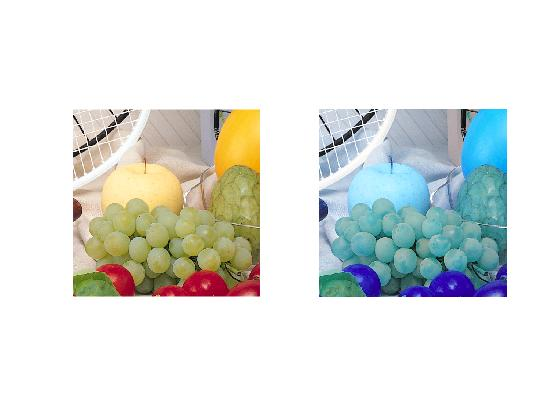

<div dir = "rtl">
<h1> تمرین بیست و دوم </h1>

<br/>
</div>

````
clc
close all
clear
````
<div dir = "rtl">
خواندن تصویر
</div>

````
pic = imread('fruits.png');

image =pic;
````

<div dir = "rtl">
استفاده از متعیر کمکی temp برای جابجا نمودن دو کانال red و Blue
</div>


````
temp= image(:,:,1);
 image(:,:,1) = image(:,:,3);
 image(:,:,3)=temp;

````

<div dir = "rtl">
نمایش خروجی
</div>

````
  subplot(1,2,1), imshow(pic);
  subplot(1,2,2), imshow(image);
````


