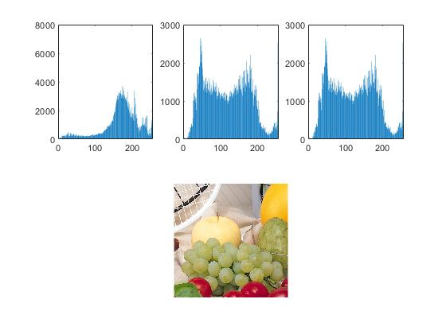

<div dir = "rtl">
<h1> تمرین بیست و سوم  </h1>

<br/>
</div>

````
clc
close all
clear
````
<div dir = "rtl">
خواندن تصویر و بدست آوردن اندازه تصویر
</div>

````
image = imread("fruits.png");
image2 = image;
[m, n ,r] = size(image);
````

<div dir = "rtl">
  به ازای هر کدام کانل ها تابع compute_hist که برای محاسبه هیستوگرام هر کانال است فراخوانده می شود.
 </div>


````
for p=1:r
  hist=compute_hist(image(:,:,p));
  bar(hist);
  subplot(2,3,p); bar(hist); 
end

````

<div dir = "rtl">
نمایش خروجی
</div>

````
  subplot(1,2,1), imshow(pic);
  subplot(1,2,2), imshow(image);
````
1
2
3
4
5
6
7
8
9
10
11
12
13
14
15
16
17
<table style="width:100%">
  <tr>
    <th>Firstname</th>
    <th>Lastname</th> 
    <th>Age</th>
  </tr>
  <tr>
    <td>Jill</td>
    <td>Smith</td> 
    <td>50</td>
  </tr>
  <tr>
    <td>Eve</td>
    <td>Jackson</td> 
    <td>94</td>
  </tr>
</table>



