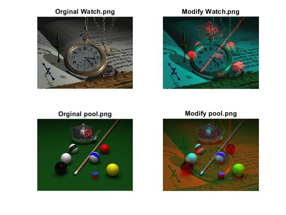

<div dir = "rtl">
<h1> تمرین بیست و چهارم  </h1>

<br/>
</div>

````
clc
close all
clear
````
<div dir = "rtl">
  خواندن دو تصویر و بدست آوردن مختصات تصویر کوچکتر و هم اندازه کردن تصویر بزرگتر با تصویر کوچکتر و نمایش تصاویر
</div>

````
pic_ww = imread('watch.png');
pic_p = imread('pool.png');
[m, n , r] = size(pic_p);
pic_w = imresize(pic_ww, [m, n]);
subplot(2,2,1), imshow(pic_w), title("Orginal Watch.png");
subplot(2,2,3), imshow(pic_p), title("Orginal pool.png");

````

<div dir = "rtl">
 استفاده از دو ماتریس برای ذخیره کانال قرمز هر تصویر و جا به حا نمودن کانال های تصویر
 </div>


````
temp_w=pic_w(:,:,1);
temp_p= pic_p(:,:,1);

pic_w(:,:,1)= temp_p;
pic_p(:,:,1) = temp_w;

````

<div dir = "rtl">
نمایش خروجی
</div>

````
subplot(2,2,2), imshow(pic_w), title("Modify Watch.png");
subplot(2,2,4), imshow(pic_p), title("Modify pool.png");
````



