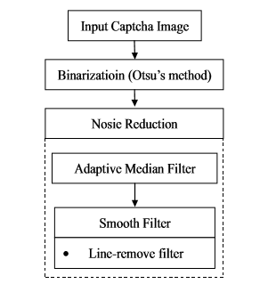

  

  <h1 align="center">مطالعه ای در مورد تشخیص Captcha
</h1>
  
 
  

  <h2 >چکیده
</h2>
بسیاری از افراد بیان می نمایند که سیستم آن ها از طریق تصاویر captcha می تواند از حمله خارجی محافظت شود. ایمنی تصاویر captcha بر اساس ساختار پیچیدگی آن ها تعیین می شود.روش های متفاوتی برای تشخیص تصاویر Captcha ارائه شده است.در این مطالعه خطوط و نقاط نویزی برای تست وجود دارند.
   چارچوب الگوی احتمال  برای شناسایی تعداد اهداف در تصاویر captcha پیشنهاد شده است.
  در این آزمایش ،مطالعات نشان می دهد که روش  پیشنهادی به طور متوسط  دقت 81.05٪ برای بیش از دو هزار مورد captcha به دست آورده است.

  <h4 >کلمات کلیدی:
</h4>
  شناسایی، احتمال، امنیت، پردازش تصویر

  <h2 >I.مقدمه
</h2>
  Captcha یک چارچوب امنیتی شبکه است که به ما در کشف نقص و جلوگیری از حملات از طریق اینترنت  کمک می نماید.
  درسال های گذشته ، تحقیقات زیادی در مورد شناسایی captha و امنیت آن  ارائه شده است [6-1].
  برای نمونه ، هوانگ و همکاران برای شناسایی captha از شبکه عصبی بازگشتی (RNN) ، SVM و یادگیری ماشین افراطی (ELM) استفاده کردند [1].
  تروونگ و همکاران برای تأمین امنیت سیستم ، یک سیستم تازه محافظت شده مانند Interactive CAPTCHA (iCAPTCHA) طراحی کرده اند [2].
  یان و همکاران از روش شمارش پیکسل برای بررسی  تصاویر captcha کمک گرفته اند وبه  موفقیت بیش از 90٪ رسیده اند [4]. Yahoo! Captcha  کاراکترهای پی در پی  را استفاده می کند که توان مقاومت در اوایل حمله را افزایش می دهد. گائو و همکارانش در مطالعات خود به   موفقیت 78٪ ونرخ موفقیت کلی 54.7٪ رسیده اند[6].
  بیشتر سیستم های captcha نشان می دهد که می توانند از حمله و تخریب جلوگیری کنند ، اما ایمنی تصاویر captcha  با توجه به پیچیدگی ساختار داخلی آن تعیین می شود. پیچیدگی بالاتر دشواری بالاتر را به همراه دارد. در این مطالعه ، امنیت سیستم captcha برای  اداره حمل و نقل در تایوان بررسی شده است. خطوط و نقاط نویزی  زیادی در تصاویر ضبط شده  اداره حمل و نقل تایوان وجود دارد و چندین هدف بوسیله نویزها  همپوشانی یا جدا شده اند. بنابراین ،  چارچوب الگوی احتمال برای شناسایی تعداد اهداف در تصاویر captcha پیشنهاد شده است.  ارزیابی کمی نشان می دهد که روش پیشنهادی به طور متوسط به دقت  81.05٪ برای بیش از دو هزار تصویر کپچا رسیده است. از این رو ، درمی یابیم که استفاده از سیستم captcha برای مدیریت حمل و نقل ممکن است با استفاده از روش شناسایی captcha قابل بررسی باشد.

  <h2 >II.شناسایی CAPTCHA توسط مدل پیشنهادی احتمال
</h2>
در این بخش ، روش الگوی احتمال  برای شناسایی captcha نشان داده شده است.
  
  

  
  <h3 align="center">شکل 1. نمودار جریان پیش پردازش</h3>

 <h3>الف.پیش پردازش
</h3>
 
به طور کلی ، تصاویر capthca نویز زیادی دارند تا در تشخیص الگو تداخل ایجاد کنند. بنابراین ، یک روش پیش پردازش برای از بین بردن نویز در تصویر captcha اعمال شده است. چارچوب پیش پردازش در شکل 1 نشان داده شده است.  از اصول پردازش تصویر برای افزایش شدت تصاویر گرفتن عکس منبع استفاده شده است. ابتدا تصویر captcha با استفاده از روش Otsu به باینری تغییر یافته تا منطقه هدف در تصاویر اصلی حفظ شود.
دوم ، ما نویز را با فیلتر متوسط تطبیقی (AMF) حذف می کنیم. فیلتر میانی تطبیقی (AMF) از تمام فیلترهای مبتنی بر میانه موجود که می توانند به طور موثر نویز را کاهش دهند و جزئیات را در تصاویر حفظ کنند ، بهتر عمل می کند [7،8].             
 
شکل 2 الگوریتم فیلتر میانه تطبیقی [9] نشان داده شده است. med میانه ماسک ،حداکثر ماسک و I (x، y) شدت تصویر در مختصات (x، y) در تصویر captcha است. علاوه بر این ، Vertical_Blk و Horizontal_Blk تعداد سیاه و سفید از طریق I (x، y) توسط ماسک های عمودی و افقی است. از آنجا که ممکن است سر و صدا به طور کامل کاهش پیدا نکند ، می توانیم فیلترهای صاف دیگری را نیز به کاهش صدا اضافه کنیم. نمونه پیش پردازش در شکل 3 نشان داده شده است. شکل 3 (a) و (b) تصاویر اصلی هستند. شکل 3 (c) و (d) تصاویر مربوط به سطح خاکستری هستند. شکل 3 (e) و (f) تصاویر باینری با استفاده از روش Otsu هستند. شکل 3 (g) و (h) نتایج پس از کاهش صدا است.
<h3>روش AMF ()
 </h3>
  
 فیلتر روی تصویر (مرحله_آ)
