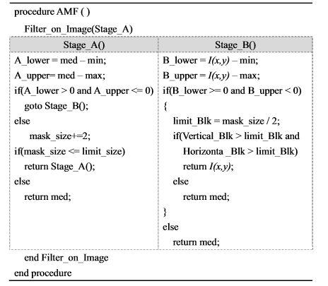
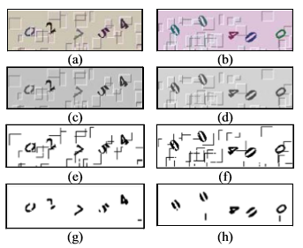
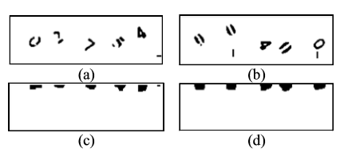
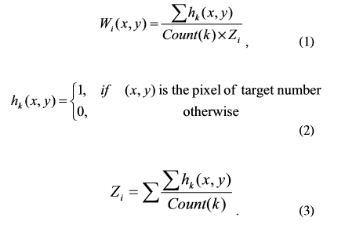
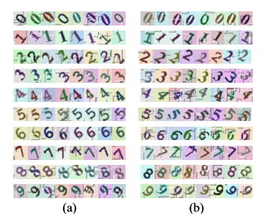
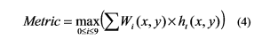
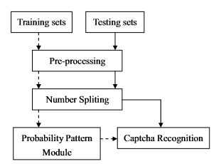
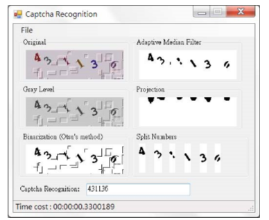

  

  <h1 align="center">مطالعه ای در مورد تشخیص Captcha
</h1>
  
 
  

  <h2 >چکیده
</h2>
بسیاری از افراد بیان می نمایند که سیستم آن ها از طریق تصاویر captcha می تواند از حمله خارجی محافظت شود. ایمنی تصاویر captcha بر اساس ساختار پیچیدگی آن ها تعیین می شود.روش های متفاوتی برای تشخیص تصاویر Captcha ارائه شده است.در این مطالعه خطوط و نقاط نویزی برای تست وجود دارند.
   چارچوب الگوی احتمال  برای شناسایی تعداد اهداف در تصاویر captcha پیشنهاد شده است.
  در این آزمایش ،مطالعات نشان می دهد که روش  پیشنهادی به طور متوسط  دقت 81.05٪ برای بیش از دو هزار مورد captcha به دست آورده است.

  <h4 >کلمات کلیدی:
</h4>
  شناسایی، احتمال، امنیت، پردازش تصویر

  <h2 >I.مقدمه
</h2>
  Captcha یک چارچوب امنیتی شبکه است که به ما در کشف نقص و جلوگیری از حملات از طریق اینترنت  کمک می نماید.
  درسال های گذشته ، تحقیقات زیادی در مورد شناسایی captha و امنیت آن  ارائه شده است [6-1].
  برای نمونه ، هوانگ و همکاران برای شناسایی captha از شبکه عصبی بازگشتی (RNN) ، SVM و یادگیری ماشین افراطی (ELM) استفاده کردند [1].
  تروونگ و همکاران برای تأمین امنیت سیستم ، یک سیستم تازه محافظت شده مانند Interactive CAPTCHA (iCAPTCHA) طراحی کرده اند [2].
  یان و همکاران از روش شمارش پیکسل برای بررسی  تصاویر captcha کمک گرفته اند وبه  موفقیت بیش از 90٪ رسیده اند [4]. Yahoo! Captcha  کاراکترهای پی در پی  را استفاده می کند که توان مقاومت در اوایل حمله را افزایش می دهد. گائو و همکارانش در مطالعات خود به   موفقیت 78٪ ونرخ موفقیت کلی 54.7٪ رسیده اند[6].
  بیشتر سیستم های captcha نشان می دهد که می توانند از حمله و تخریب جلوگیری کنند ، اما ایمنی تصاویر captcha  با توجه به پیچیدگی ساختار داخلی آن تعیین می شود. پیچیدگی بالاتر دشواری بالاتر را به همراه دارد. در این مطالعه ، امنیت سیستم captcha برای  اداره حمل و نقل در تایوان بررسی شده است. خطوط و نقاط نویزی  زیادی در تصاویر ضبط شده  اداره حمل و نقل تایوان وجود دارد و چندین هدف بوسیله نویزها  همپوشانی یا جدا شده اند. بنابراین ،  چارچوب الگوی احتمال برای شناسایی تعداد اهداف در تصاویر captcha پیشنهاد شده است.  ارزیابی کمی نشان می دهد که روش پیشنهادی به طور متوسط به دقت  81.05٪ برای بیش از دو هزار تصویر کپچا رسیده است. از این رو ، درمی یابیم که استفاده از سیستم captcha برای مدیریت حمل و نقل ممکن است با استفاده از روش شناسایی captcha قابل بررسی باشد.

  <h2 >II.شناسایی CAPTCHA توسط مدل پیشنهادی احتمال
</h2>
در این بخش ، روش الگوی احتمال  برای شناسایی captcha نشان داده شده است.
  
  

  
  <h3 align="center">شکل 1. نمودار جریان پیش پردازش</h3>

 <h3>الف.پیش پردازش
</h3>
 
به طور کلی ، تصاویر capthca نویز زیادی دارند تا در تشخیص الگو تداخل ایجاد کنند. بنابراین ، یک روش پیش پردازش برای از بین بردن نویز در تصویر captcha اعمال شده است. چارچوب پیش پردازش در شکل 1 نشان داده شده است.  از اصول پردازش تصویر برای افزایش شدت تصاویر گرفتن عکس منبع استفاده شده است. ابتدا تصویر captcha با استفاده از روش Otsu به باینری تغییر یافته تا منطقه هدف در تصاویر اصلی حفظ شود.
دوم ، ما نویز را با فیلتر متوسط تطبیقی (AMF) حذف می کنیم. فیلتر میانی تطبیقی (AMF) از تمام فیلترهای مبتنی بر میانه موجود که می توانند به طور موثر نویز را کاهش دهند و جزئیات را در تصاویر حفظ کنند ، بهتر عمل می کند [7،8].             
 
در شکل 2 الگوریتم فیلتر میانه تطبیقی [9] نشان داده شده است. med میانه ماسک ،حداکثر ماسک و I (x، y) شدت تصویر در مختصات (x، y) در تصویر captcha است. علاوه بر این ، Vertical_Blk و Horizontal_Blk تعداد سیاه و سفید از طریق I (x، y) توسط ماسک های عمودی و افقی است. از آنجا که ممکن است سر و صدا به طور کامل کاهش پیدا نکند ، می توانیم فیلترهای صاف دیگری را نیز به کاهش صدا اضافه کنیم. نمونه پیش پردازش در شکل 3 نشان داده شده است. شکل 3 (a) و (b) تصاویر اصلی هستند. شکل 3 (c) و (d) تصاویر مربوط به سطح خاکستری هستند. شکل 3 (e) و (f) تصاویر باینری با استفاده از روش Otsu هستند. شکل 3 (g) و (h) نتایج پس از کاهش صدا است.
  

  
  <h3 align="center"> شکل 2. الگوریتم فیلتر میانه تطبیقی (AMF).    </h3>

 

  
  <h3 align="center">شکل 3. نمونه ای  پیش پردازش. (a) و (b) تصاویر اصلی captcha هستند. (c) و (d) تصاویر خاکستری هستند. (e) و (f) تصاویر باینری هستند. (g) و (h) نتایج پس از کاهش نویز هستند.</h3>

  
 <h3>ب - روش تقسیم شماره پس از انجام پیش پردازش
</h3>
  
  می توان اعداد هدف (0 تا 9) را در هر تصویر captcha بدست آورد. همانطور که در شکل 4 نشان داده شده است ، می توان پیکسل های سیاه باقیمانده را به چندین منطقه در محور X با روش فرافکنی جمع کرد ، اگر عرض  ناحیه متراکم  به اندازه کافی گسترده نباشد ، ممکن است در  این ناحیه عدد صحیحی نباشد. با این حال ، هنگامی که عرض ناحیه  متراکم  بیش از حد گسترده باشد ، ممکن است با دو یا چند عدد همپوشانی داشته باشد. با توجه به این فرمول ، ما می توانیم اعداد را از تصاویر captcha جدا کنیم.
 
 
  

  
  <h3 align="center">شکل 4. پیکسلهای سیاه و سفید با استفاده از روش نگاشت  می توانند در چندین محور در محور X جمع شوند. (الف) و (ب) نتایج پس از پیش پردازش هستند. (c) و (d) نتایج پس از نگاشت در محور X هستند.</h3>

 <h3>ج - ماژول احتمال الگو
</h3>

ز آنجا که اعداد هدف در تصویر captcha از -45 به 45 درجه مورب می شوند ، ما یک ماژول احتمال برای کمک به سازماندهی مجدد شماره ایجاد کردیم. در شکل 5 ، ماژول احتمال را می توان با درجه مورب به دو قسمت تقسیم کرد: (الف) از -45 تا 0 درجه و (ب) از 0 تا 45 درجه. توابع احتمال نیز به صورت زیر تعریف شده است:

 

  
  

Wi (x، y) یک تابع وزنی است که احتمال پیکسل برای هر عدد هدف قرار دارد (i = 0 تا 9). (x، y) مختصات تصویربرداری است. hk (x، y) تابع فرضیه مجموعه آموزش است (k = 0 تا 9) و Count (k) تعداد آموزش در مورد k است. اگر (x، y) پیکسل شماره هدف باشد ، hk (x، y) برابر با 1 است. Zi یک تابع نرمال سازی است.

  

  
  <h3 align="center">شکل 5. ماژول احتمال را می توان با درجه کج به دو قسمت تقسیم کرد: (a) از -45 تا 0 درجه و (b) از 0 تا 45 درجه.</h3>

<h3>د- تشخیص عدد از تصویر Captcha
</h3>

ماژول احتمال پیشنهادی می تواند اساسی مفید برای روش تنظیم مجدد شماره زیر در تصاویر captcha باشد.
  با توجه به درجه کج شده هر عدد در ماژول احتمال ، هر عدد تقسیم شده ، همانطور که در شکل 4 (a) و شکل 4 (b) نشان داده شده است ، می تواند مبنای احتمال مربوطه را پیدا کند ، همانطور که در شکل 5 نشان داده شده است ، بوسیله  معادله تطبیقی زیر
  
 

  
  

از معادله فوق برای اسکن مناطق انتخابی در تصاویر captcha با جهت عمودی استفاده شده است. ht (x، y) تابع فرضیه منطقه هدف است. وقتی معیار محصول تابع وزن Wi (x، y) و تابع فرضیه ht (x، y) حداکثر باشد ، عدد i به عنوان پاسخ نهایی تایید می شود.  

  <h2 >III. نتایج آزمایشات
</h2>
روش پیشنهادی بر روی بیش از دو هزار مورد captcha  آزمایش شده است. چهار تا هفت عدد در هر تصویر captcha پنهان شده است. همانطور که در شکل 5 نشان داده شده است ،به طور تصادفی 100 مورد برای ایجاد ماژول احتمال به دست آمده است . شکل 6 در این مطالعه چارچوب تشخیص captcha را نشان می دهد. از آنجا که هدف تشخیص موثراعداد می باشد ، از برخی روشهای پردازش تصویر برای تقسیم اعداد در تصاویر captcha استفاده می شود.  برای محاسبه شباهت بین مجموعه های آموزشی و مجموعه تست ها از معادله تطبیق ، مانند eqn. (4) استفاده شده است. نتیجه آزمایشی در شکل 7 نشان داده شده است. ارزیابی کمی نشان داده است که  روش  پیشنهادی به طور متوسط به دقت  81.05٪ برای بیش از دو هزار تصویر کپچا رسیده است.
    

  
  <h3 align="center">شکل 6. چارچوب تشخیص تصاویر captcha</h3>

 

  
  <h3 align="center">   شکل 7. نمونه ای از روش  پیشنهادی شناسایی captcha .  </h3>

  

  

    <h2 >IV.نتیجه گیری
</h2>
در این مطالعه ، سعی شده است  امنیت سیستم captcha  برای  اداره حمل و نقل در تایوان بررسی شود. خطوط و نقاط نویز زیادی در تصاویر captcha آزمایش وجود دارد و چندین عدد هدف بوسیله نویزها همپوشانی یا جدا شده اند. به منظور تجزیه و تحلیل این تصاویر captcha ،  چارچوب الگوی احتمال  برای شناسایی اعداد هدف در همه موارد captcha پیشنهاد شده است . با توجه به نتیجه آزمایش ، ما می توانیم دریابیم که خطر سیستم captcha برای این مدیریت حمل و نقل ممکن است با روش پیشنهادی تشخیص captcha وجود داشته باشد. می توان  چند پیشنهاد برای این اداره حمل و نقل ارائه شود تا سیستم captcha آنها در آینده تقویت شود.  

  <h3 dir="rtl">منابع</h3>
  
  [1]  S.G. Huang, L. Zhang, P.P. Wang, and H.W. Han, "A CAPTCHA Recognition Algorithm Based on Holistic Verification," in 2011 First International Conference on Instrumentation, Measurement, Computer, Communication and Control, Beijing, China, 2011, pp. 525-528. 
  [2]  H.D. Truong, C.F. Turner, and C.C. Zou, "iCAPTCHA: The Next Generation of CAPTCHA Designed to Defend against 3rd Party Human Attacks," in 2011 IEEE International Conference on Communications (ICC), Kyoto, Japan, 2011, pp. 1-6. 
  [3]  A.S. El Ahmad, J. Yan, and W.Y. Ng, "CAPTCHA Design: Color, Usability, and Security," IEEE Internet Computing, vol. 16, no. 1, pp. 44-51, Mar. 2012. 
  [4]  J. Yan and A.S. EL Ahmad, "CAPTCHA Security: A Case Study," IEEE Security & Privacy, vol. 7, no. 4, pp. 22-28, Aug. 2009. 
  [5]  A. Chandavale and A. Sapkal, "An Improved Adaptive Noise Reduction for Secured CAPTCHA," in 2011 4th International Conference on Emerging Trends in Engineering and Technology (ICETET), Port Louis, Mauritius, 2011, pp. 1217. 
  [6]  H.C. Gao, W. Wang, and Y. Gan, "Divide and Conquer: An Efficient Attack on Yahoo! CAPTCHA," in 2012 IEEE 11th International Conference on Trust, Security and Privacy in Computing and Communications (TrustCom), Liverpool, U.K., 2012, pp. 9-16.  
  [7]  P.E. Ng and K.K. Ma, "A switching median filter with boundary discriminative noise detection for extremely corrupted images," IEEE Trans. on Image Processing, vol. 15, no. 6, pp. 1506-1516, June 2006.  
  [8]  H.L. Eng and K.K. Ma, "Noise adaptive soft-switching median filter," IEEE Trans. on Image Processing, vol. 10, no. 2, pp. 242-251, Feb. 2001.  
  [9]  R.C. Gonzalez and R.E. Woods, Digital Image Processing, Third ed. Pearson / Prentice Hall, 2008. 
 
 
  

