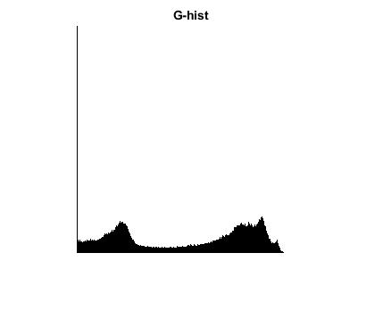

<div dir="rtl">

####  تمرین 23 <br />


اندازه تصویر  را در دو متغییر x , y  قرار می دهد.<br />
 یک ماتریس یک بعدی با 255 خانه به نام histo درست می کنم<br />
حلقه for تودر تو ماتریس ورودی را پیمایش کرده و برای هر مقدار(0-255) پیکسلها <br />را میشمرد.
در نهایت ماتریس histo را که حاوی تعداد هر مقدار است بر می گرداند.<br />
 خروجی بدست آمده را نرمال می کند<br />
 
 </div>

```
function [histo]=tohist(image)
[x,y]=size(image);
histo=zeros(1,256);
for a=1:x
    for b=1:y
        cont=image(a,b);
        histo(cont+1)=histo(cont+1)+1;
    end
end
histo=fix((histo/max(histo))*255);
```

<div dir="rtl">

 خواندن تصویر peppers.png از شاخه بنچ مارک در ماتریس image<br />
هر کانال را بعنوان پارامتر تابعی که جهت استخراج هیستوگرام نوشتیم  </div>

```
image = imread("../../../benchmark/peppers.png");
R=tohist(image(:, :, 1));
G=tohist(image(:, :, 2));
B=tohist(image(:, :, 3));
for i = 1:255
    RR(1:255-R(i),i)=255;
    GG(1:255-G(i),i)=255;
    BB(1:255-B(i),i)=255;
end
```

<div dir="rtl">

3-
نمایش تصویر اصلی و هستوگرام هر کانال خروجی با دستور imshow
</div>

```
imshow(image);
figure;
imshow(RR);
title('R-hist');
figure;
imshow(GG);
title('G-hist');
figure;
imshow(BB),title('B-hist');
```




