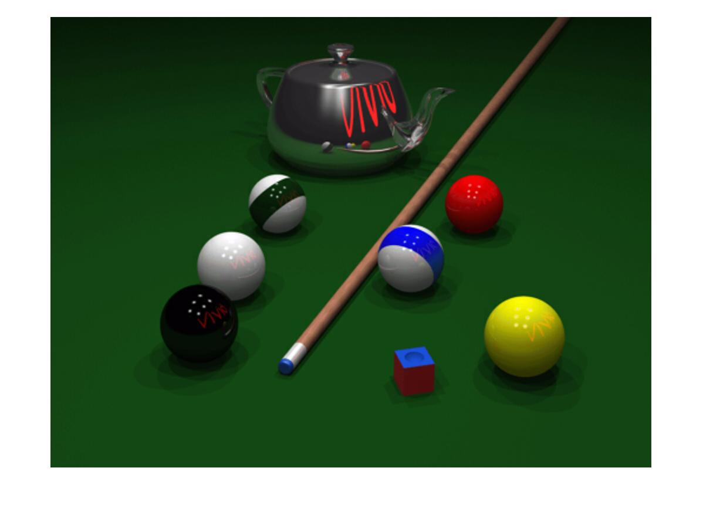
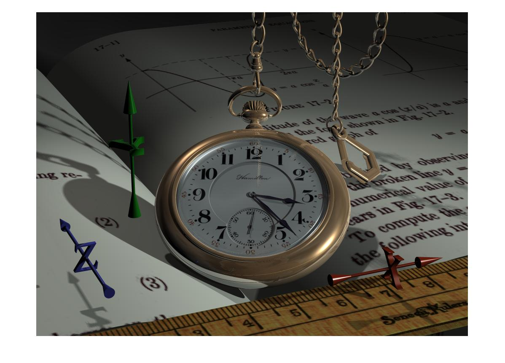
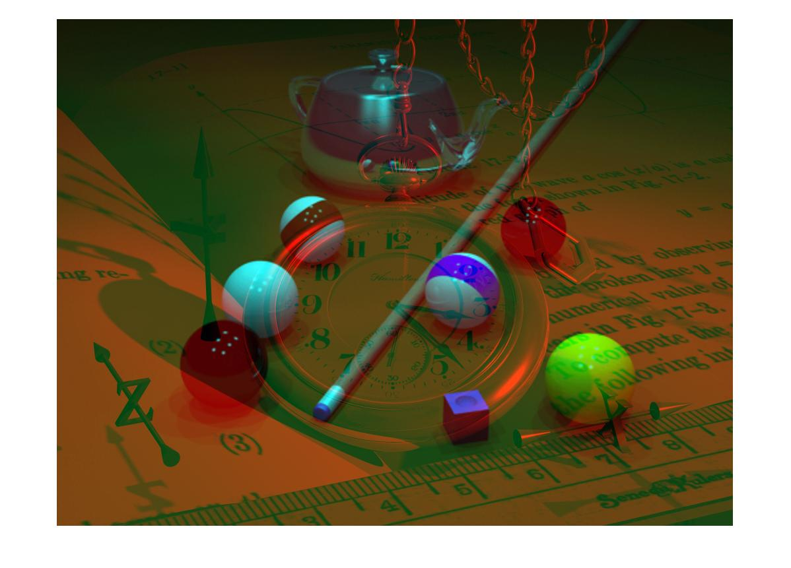
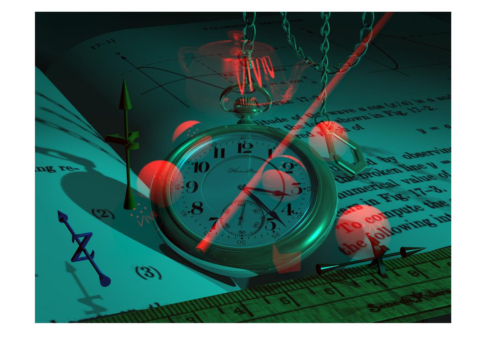

<div dir="rtl">

####  تمرین24 <br />


 تصویر ساعت و استخر از شاخه بنچ مارک  لود شده اند.<br />
 ابعاد هر ماتریس تصویر با دستور size بدست آمده و در متغییر های مربوطه جهت استفاده های بعدی ذخیره می شود.<br />
 دو تصویر را هم اندازه با دستور imresize کردیم.<br />
</div>

```
watch=imread("../../../benchmark/watch.png");
[a,b,c]=size(watch);
imshow(watch)
pool=imread("../../../benchmark/pool.png");
pool=imresize(pool,[a b]);
figure;
imshow(pool);
```

<div dir="rtl">

حلقه for تودرتو که کانال قررمز دو تصویر  را در تصویر دیگر کپی می کند.
</div>

```matlab
watchR = watch(:, :, 1);
poolR = pool(:, :, 1);
watch(:, :, 1)=poolR;
pool(:, :, 1)=watchR;
```
<div dir="rtl">

 دو تصویر نهایی با دستور  imshow نماییش داده می شود.
</div>

```matlab
figure;
imshow(watch);
figure;
imshow(pool); 

```






