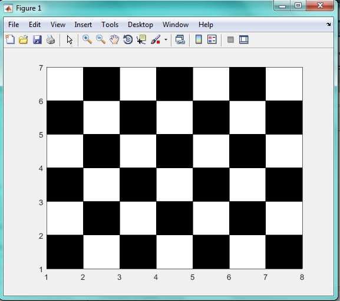

<div dir="rtl">
 جواب سوال 1 :
صورت سوال: برنامه ای بنویسید که با دریافت یک طول و عرض به عنوان مقدار طول و عرض تصویر یک صفحه ی شطرنج ایجاد کنید.
 همان طور که در صورت سوال گفته شد، برنامه دو عدد را به عنوان طول و عرض دریافت می کند و یک صفحه شطرنج (بدون هیچ پیش شرط دیگری) تحویل می دهد.
</div>

<div dir="rtl">
 قطعه کد زیر، دو ورودی را به عنوان طول و عرض صفحه شرنجی دریافت می کند:
</div>

```
m= input('arz ra vared konid=');
n= input('tul ra vared konid=');
```

<div dir="rtl">
حلقه زیر، خانه های شطرنج را یک به یک پیمایش کرده، و رنگ آن ها را یک در میان عوض می کند. برای تغییر رنگ از متغیر کمکی a استفاده کردیم. هر بار که یک خانه به جلو حرکت می کنیم، مقدار a از یک به صفر یا برعکس تغییر می کند:
</div>


```
a=1;
for i=1:1:m
    
    for j=1:1:n
       
          if a==0
            rectangle('Position',[j i 1 1], 'FaceColor',[1 1 1])
            a=1;
        else
            rectangle('Position',[j i 1 1], 'FaceColor',[0 0 0])
            a=0;
        end
        
    end
```
    
<div dir="rtl">
 در صورتی که تعداد ستون ها فرد باشند، خروجی الگوریتم به این صورت خواهد بود که هر ستون یک رنگ دارد. برای رفع این مشکل، ازین شرط استفاده می کنیم که اگر به سطر زوج بعدی رسیدیم، مقدار  a را تغییر دهد تا رنگ خانه اول تغییر کند
</div>

```
    if rem(j,2)==0
            if a==0
            a=1;
            else
            a=0;
            end
        end
     
end
```

 
 <div dir="rtl">
خروجی کد بالا به صورت زیر است : 
</div>


