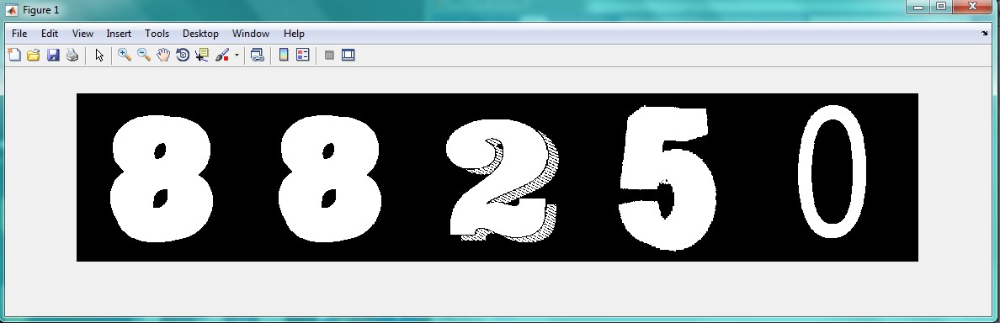

<div dir="rtl">
جواب سوال 10:
این برنامه، عکس اعداد را می خواند و آن ها را به باینری تبدیل کرده و سایزشان را به 200 در 200 برمیگرداند. در نهایت، 5 متغیر تعریف کردیم که هر کدام از آن ها، به صورت رندوم یکی از اعداد را در خودشان ذخیره می کنند و در خرجی پشت سر هم چاپ می شوند.
</div>

```
m=imread('C:\Users\PC\Desktop\0.png');
m1=im2bw(m,0.0001);
m2=imresize(m1,[200,200]);
n=imread('C:\Users\PC\Desktop\1.png');
n1=im2bw(n,0.0001);
n2=imresize(n1,[200,200]);
o=imread('C:\Users\PC\Desktop\2.png');
o1=im2bw(o,0.0001);
o2=imresize(o1,[200,200]);
p=imread('C:\Users\PC\Desktop\3.png');
p1=im2bw(p,0.001);
p2=imresize(p1,[200,200]);
q=imread('C:\Users\PC\Desktop\4.png');
q1=im2bw(q,0.00001);
q2=imresize(q1,[200,200]);
r=imread('C:\Users\PC\Desktop\5.jpg');
r1=im2bw(r,0.00001);
r2=imresize(r1,[200,200]);
s=imread('C:\Users\PC\Desktop\6.png');
s1=im2bw(s,0.00001);
s2=imresize(s1,[200,200]);
t=imread('C:\Users\PC\Desktop\7.png');
t1=im2bw(t,0.00001);
t2=imresize(t1,[200,200]);
u=imread('C:\Users\PC\Desktop\8.png');
u1=im2bw(u,0.00001);
u2=imresize(u1,[200,200]);
w=imread('C:\Users\PC\Desktop\9.png');
w1=im2bw(w,0.001);
w2=imresize(w1,[200,200]);
%baraye entekhabe avalin adad:
a=randi(10);
if a==1
    a=m2
else if a==2
        a=n2
    else if a==3
          a=o2
        else if a==4
                a=p2
            else if a==5
                    a=q2
                else if a==6
                        a=r2
                    else if a==7
                            a=s2
                        else if a==8
                                a=t2
                            else if a==9
                                    a=u2
                                else if a==10
                                        a=w2
                                    end
                                end
                            end
                        end
                    end
                end
            end
        end
    end
end
%baraye entekhabe 2vomin adad:
b=randi(10);
if b==1
    b=m2
else if b==2
        b=n2
    else if b==3
          b=o2
        else if b==4
                b=p2
            else if b==5
                    b=q2
                else if a==6
                        b=r2
                    else if b==7
                            b=s2
                        else if b==8
                                b=t2
                            else if b==9
                                    b=u2
                                else if b==10
                                        b=w2
                                    end
                                end
                            end
                        end
                    end
                end
            end
        end
    end
end
%baraye entekhabe 3omin adad
c=randi(10);
if c==1
    c=m2
else if c==2
        c=n2
    else if c==3
          c=o2
        else if c==4
                c=p2
            else if c==5
                    c=q2
                else if c==6
                        c=r2
                    else if c==7
                            c=s2
                        else if c==8
                                c=t2
                            else if c==9
                                    c=u2
                                else if c==10
                                        c=w2
                                    end
                                end
                            end
                        end
                    end
                end
            end
        end
    end
end
%baraye entekhabe 4omin adad
d=randi(10);
if d==1
    d=m2
else if d==2
        d=n2
    else if d==3
          d=o2
        else if d==4
                d=p2
            else if d==5
                    d=q2
                else if d==6
                        d=r2
                    else if d==7
                            d=s2
                        else if d==8
                                d=t2
                            else if d==9
                                    d=u2
                                else if d==10
                                        d=w2
                                    end
                                end
                            end
                        end
                    end
                end
            end
        end
    end
end
%baraye entekhabe 5 omin adad:
e=randi(10);
if e==1
    e=m2
else if e==2
        e=n2
    else if e==3
          e=o2
        else if e==4
                e=p2
            else if e==5
                    e=q2
                else if e==6
                        e=r2
                    else if e==7
                            e=s2
                        else if e==8
                                e=t2
                            else if e==9
                                    e=u2
                                else if e==10
                                        e=w2
                                    end
                                end
                            end
                        end
                    end
                end
            end
        end
    end
end
l=[a b c d e];
imshow(l);
    
```


