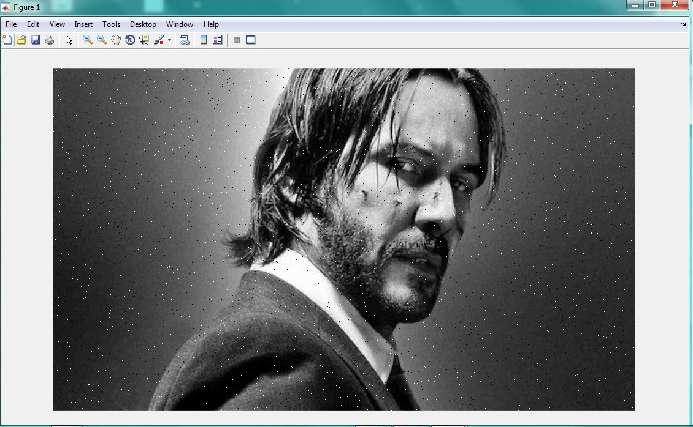
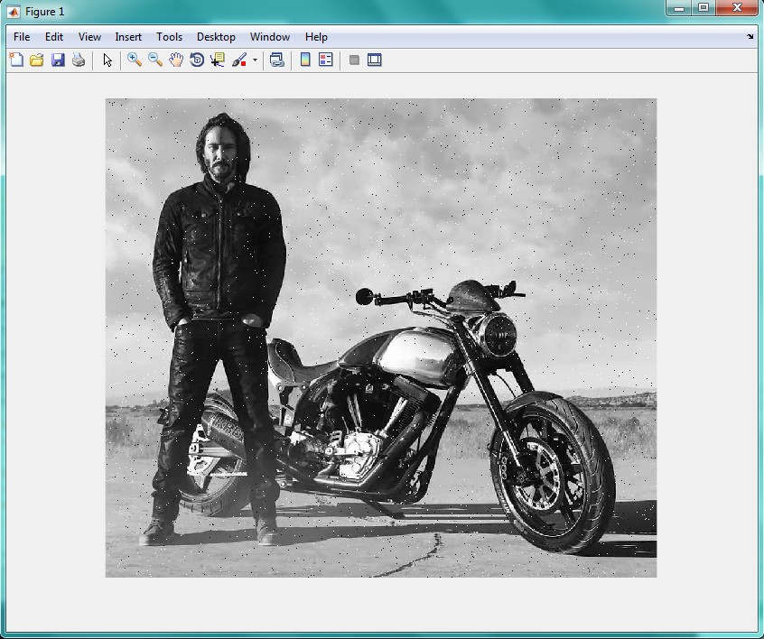

<div dir="rtl">
جواب سوال 11:
    ابتدا تصویر را دریافت و در صورت رنگی بودن، آن را به تصویر خاکستری تبدیل می کنیم
</div>

```
i=imread('C:\Users\PC\Desktop\11.jpg');  
i=rgb2gray(i);
b=0;w=255;  %farz bar in ast le meghdare pixel haye meshli barabare '0' va meghdare pixel haye sefid '255' bashad
img_with_noise= i; 
[m,n]=size(i); %bedast avardane size tasvir
x = randint(m,n,[0,255]);
%sakhte yek matrixe randome mxn ke ham size tasvire asli ast va meghdar bazi az pixel haye randomash meghdar 0 ya 255 migirand. 
img_with_noise(x <= b) = 0;  
 img_with_noise(x >=w) = 255;
imshow(img_with_noise) %namayeshe tasvir
```

<div dir="rtl">
نتیجه خروجی این کد برای چند تصویر خاکستری و رنگی به صورت زیر است:
</div>





