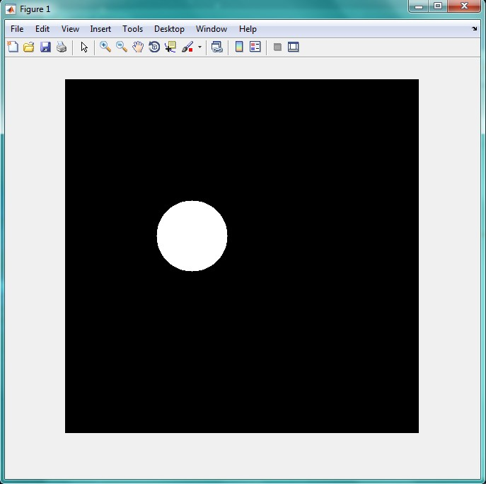

<div dir="rtl">
جواب سوال 2:
</div>

```
A=zeros(1000,1000);
r =input('shoaa ra vared konid='); %radius
x=input('x markaze dayere ra vared konid=');
y=input('y markaze dayere ra vared konid=');
m = {x,y}; %midpoint
A(m{:})=1;
B = bwdist(A) <= r;
imshow(B)
```

<div dir="rtl">
این قطعه کد، شعاع و مختصات مرکز دایره را دریافت می کند و آن را در یک تصویر 1000 در 1000 رسم می کند. تصویر خروجی به شکل زیر است: 
</div>


