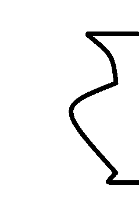
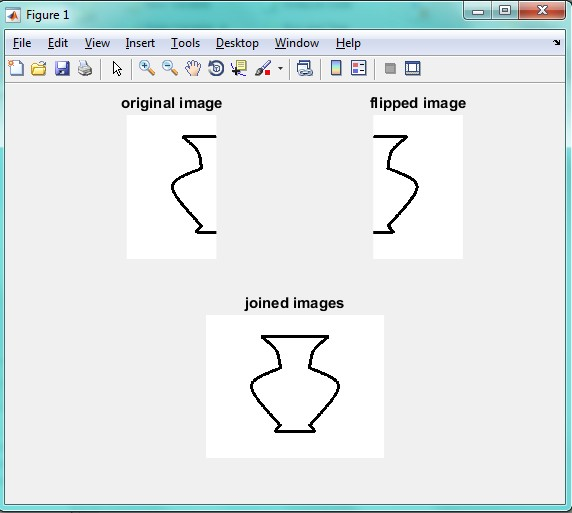

<div dir="rtl">
جواب سوال 5:
    تصویر نیمی از یک کوزه را داریم و می خواهیم آن را کامل کنیم:
</div>



```
title 'original image' 
% Flip left/right: 
Ir = flipdim(I,2); 
subplot(2,2,2) 
imshow(Ir)
title 'flipped image'
% Join the original and flipped images: 
IIr = horzcat(I,Ir); 
subplot(2,2,3:4) 
imshow(IIr)
title 'joined images'
```
<div dir="rtl">
خروجی این برنامه به صورت زیر است:
</div>


