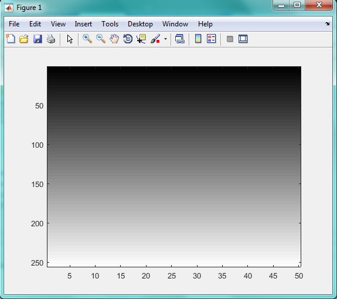

<div dir="rtl">
جواب سوال 6:
</div>

```
m=input('tule tasvir ra vared konid');
a=zeros(255,m);
    for i=1:1:256
        for j=1:1:m
           a(i,j)=i;
                 
        end
    end
    a
    imagesc(a)
    colormap(gray)
    
```


