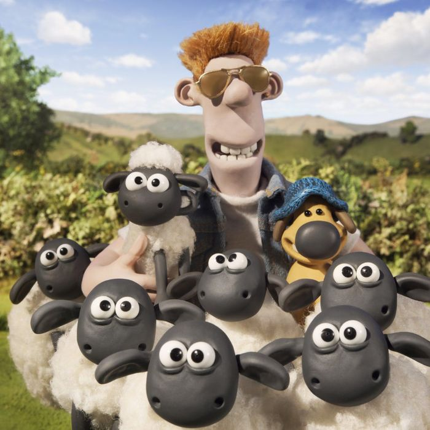
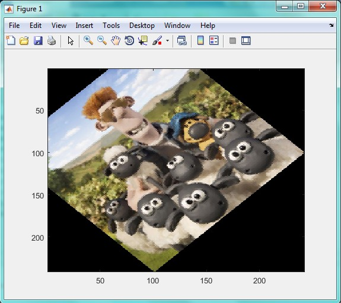
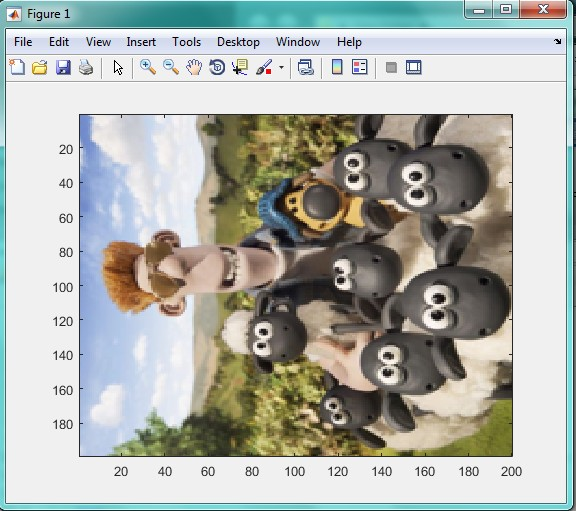
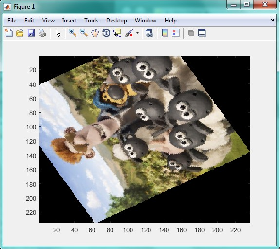
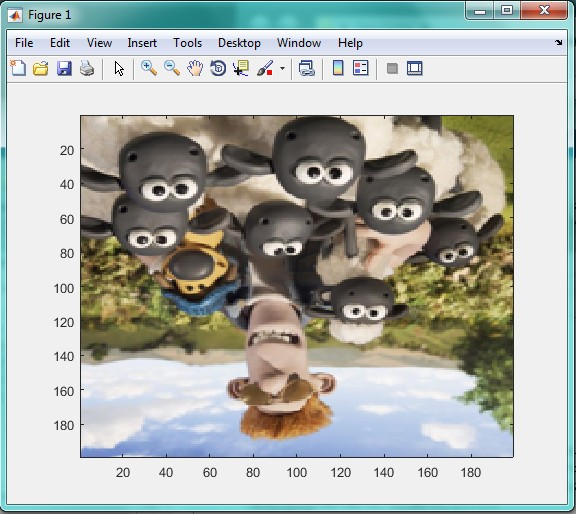

<div dir="rtl">
جواب سوال 8:
    برای حل این سوال، از چرخش پیکسل به پیکسل استفاده کردیم، در این نوع چرخش برخی از مقادیر پیکسل ها تغییر می کنند به همین دلیل کیفیت  تصویر مانند اولش نخواهد بود.
    تصویر اصلی به صورت زیر است:
</div>



```
clc;
clear;
x=imread('C:\Users\PC\Desktop\8.jpg');
x=imresize(x,[200 200]);
x3=double(x);
degree=input('daraje ra vared konid');
for i=1:400
for j=1:400
x1(i,j)=round((i-100).*cosd(degree)+(j-100).*sind(degree)+100);
x2(i,j)=round(-(i-100).*sind(degree)+(j-100).*cosd(degree)+100);
if(x1(i,j)<=200)&&(x1(i,j)>0)&&(x2(i,j)<=200)&&(x2(i,j)>0)
      a(i,j,:)=x3(x1(i,j),x2(i,j),:);
  end;
  end;
  end;
image(uint8(a));
imshow(a(i,j));
```

<div dir="rtl">
تصاویر پایین، به ترتیب چرخش های 45، 90، 120 و 180 هستند:
</div>








