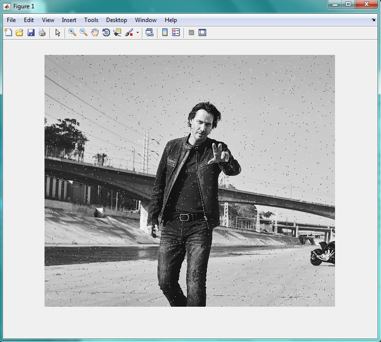
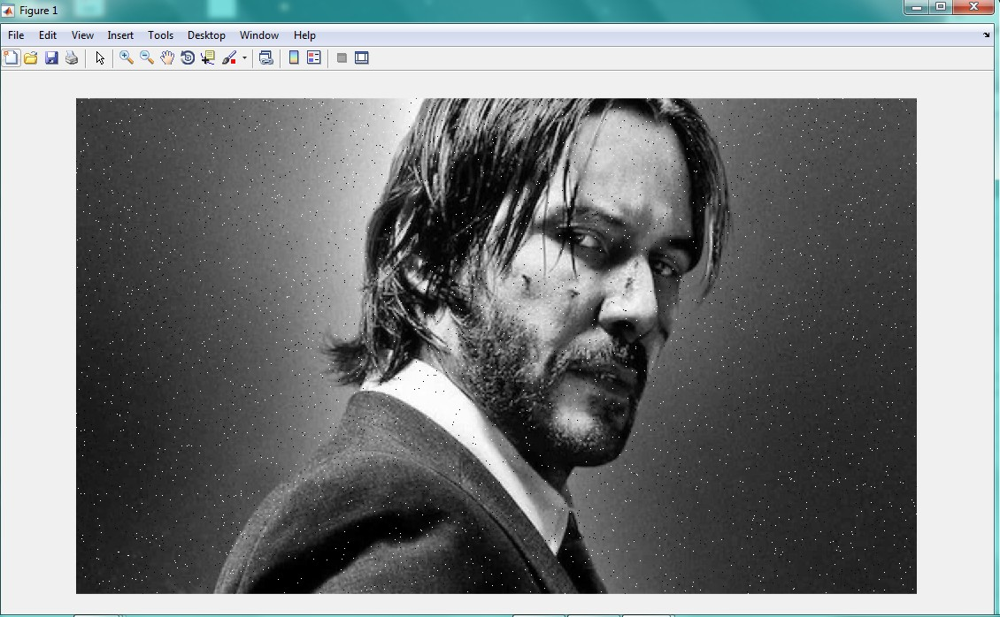
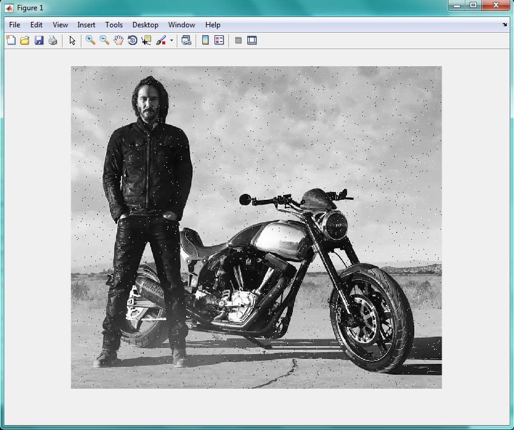

<div dir="rtl">
جواب سوال 11:
    صورت سوال: بدون استفاده از دستورهای آماده ی متلب نویز فلفل نمکی را روی چند تصویر ایجاد کنید.
    ابتدا تصویر را دریافت و در متغیر i قرار می دهیم. از آن جایی که نویز فلفل نمکی فقط روی تصاویر خاکستری اعمال می شود، در صورتی رنگی بودن، آن را با تابع rgb2gray خاکستری می کنیم:
</div>

```
i=imread('C:\Users\PC\Desktop\11.jpg');  
i=rgb2gray(i);
```

<div dir="rtl">
فرض بر این است که مقادیر پیکسل های مشکی 0 و پیکسل های سفید 255 هستند. این مقادیر را درون متغیر های b و w قرار می دهیم:
</div>

```
b=0;w=255;
```

<div dir="rtl">
یک کپی از تصویر را درون متغیر img_with_noise قرار می دهیم. سپس اندازه آن را در متغیر های m و n قرار می دهیم:
</div>

```
img_with_noise= i; 
[m,n]=size(i);
```

<div dir="rtl">
در مرحله بعد، یک ماتریس رندوم m در n می سازیم که هم سایز با تصویر اصلی مان است و برخی از پیکسل هایش به صورت رندوم مقادیر 0 یا 255 دارند:
</div>

```
x = randint(m,n,[0,255]);
%sakhte yek matrixe randome mxn ke ham size tasvire asli ast va meghdar bazi az pixel haye randomash meghdar 0 ya 255 migirand. 
img_with_noise(x <= b) = 0;  
 img_with_noise(x >=w) = 255;
```
 
<div dir="rtl">
در پایان، با استفاده از تابع imshow تصویر نهایی را نمایش می دهیم:
</div>
 
```
imshow(img_with_noise)
```

<div dir="rtl">
نتیجه خروجی این کد برای چند تصویر خاکستری و رنگی به صورت زیر است:
</div>






