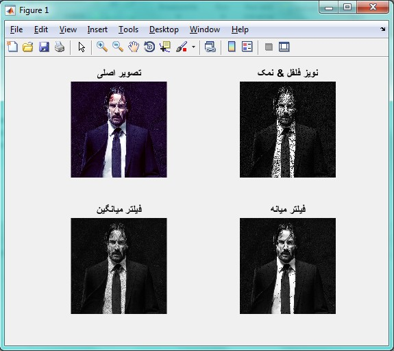

<div dir="rtl">
با تشکر از آقای "سید احمد داوود موسوی" که فایل و توضیحات کامل این سوال رو در اختیار من گذاشتن
</div>

<div dir="rtl">
جواب سوال 12:
  با کمک برنامه ی تمرین قبل برنامه ای بنویسید که مقدار تمام پیکسل های خروجی از فیلتر میانه، فیلتر میانگین، نویز فلفل نمکی را با یک عدد صحیح محاسبه کند.
</div>

<div dir="rtl">
یک تصویر را از ورودی خوانده و آن را در متغیر am1 قرار می دهیم. سپس آن را به خاکستری تبدیل کرده و تعداد سط ها و ستون هایش را درون متغیر row و col قرار می دهیم:
</div>

```
addpath("../../../benchmark/");
im1 =imread("lena.png");
im = rgb2gray(im1);
row = size(im , 1);
col = size(im , 2);
```

<div dir="rtl">
در این قسمت، می خواهیم نویز فلفل و نمک را روی تصویر اعمال کنیم. این قسمت از برنامه، از ورودی درصد اعمال نویز را دریافت می کند و با توجه به آن، آن درصد را به صورت رندوم روی پیکسل های تصویر اعمال می کند:
</div>

```
noise_im = im;
si = row * col;
percent = input('percent = ');
choose = round((si * percent) / 100);

for i = 1 : choose
    x = randi([1 row]);
    y = randi([1 col]);
    noise_im(x,y) = 0;
end
```

<div dir="rtl">
در مرحله بعد، فیلتر میانگین را برای بهبود کیفیت تصویر اعمال می کنیم:
</div>

```
%mean filter
avg_im = uint8(zeros(row,col));

for i = 1 : row
    for j = 1 : col
        rmin = max(1 , i-1);
        rmax = min(row , i+1);
        cmin = max(1,j-1);
        cmax = min(col , j+1);
        temp = noise_im(rmin : rmax , cmin : cmax);
        avg_im(i,j) = mean(mean(temp));
    end
end
```

<div dir="rtl">
در مرحله بعد، فیلتر میانه را برای بهبود کیفیت تصویر اعمال می کنیم:
</div>

```
%median filter
med_im = uint8(zeros(row,col));

for i = 1 : row
    for j = 1 : col
        rmin = max(1 , i-1);
        rmax = min(row , i+1);
        cmin = max(1,j-1);
        cmax = min(col , j+1);
        temp = noise_im(rmin : rmax , cmin : cmax);
        med_im(i,j) = median(median(temp));
    end
end
```

<div dir="rtl">
مقدار پیکسل های خروجی در نویز فلفل نمک و فیلتر های میانگین و میانه را با استفاده از تابع round به یک عدد صحیح تبدیل کرده و در متغیر های هم اسمشان قرار می دهیم:
</div>

```
%calculate
mean_noise = round(mean(mean(noise_im)));
mean_avg = round(mean(mean(avg_im)));
mean_med = round(mean(mean(med_im)));
```

<div dir="rtl">
در پایان، برای نمایش تصاویر حال از نویز فلفل نمک و فیلتر های میانه و میانگین، از دستورات زیر استفاده می کنیم:
</div>

```
%show
display(mean_noise);
display(mean_avg);
display(mean_med);

%show
subplot(2,2,1);
imshow(im1);title('تصویر اصلی');

subplot(2,2,2);
imshow(noise_im);title('نویز فلفل & نمک');

subplot(2,2,3);
imshow(avg_im);title('فیلتر میانگین');

subplot(2,2,4);
imshow(med_im);title('فیلتر میانه');
```

<div dir="rtl">
   می توانید پس از اجرای کد، مقادیر میانگین نویز فلفل& نمک و فیلتر های میانگین و میانه را در کامند ویندو مشاهده کنید
</div>

 
 <div dir="rtl">
خروجی کد به صورت زیر است : 
</div>



