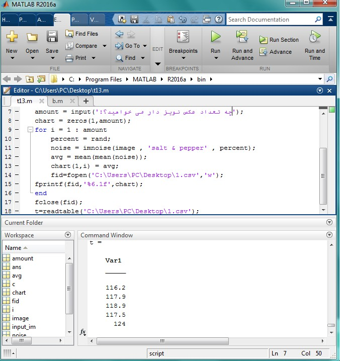

<div dir="rtl">
با تشکر از آقای "سید احمد داوود موسوی" که فایل و توضیحات کامل این سوال رو در اختیار من گذاشتن
</div>
@arman-ariamehr

<div dir="rtl">
جواب سوال 13:
  صورت سوال: روی یک تصویر نگاتیو نویز فلفل نمکی را با اعداد مختلف امتحان کنید و میانگین تمام پیکسل های آن را در یک جدول خروجی دهید.
</div>

<div dir="rtl">
یک تصویر نگاتیو انتخاب می کنیم:
</div>


<div dir="rtl">
با استفاده از تابع imread آن را خوانده و در متغیر input_im قرار می دهیم:
</div>

```
input_im = imread('.\jd.png');
```

<div dir="rtl">
از آنجایی که نویز فلفل نمک فقط روی تصاویر خاکستری اعمال می شود و تصاویر نگاتیو عموما رنگی هستند، این شرط را لحاظ می کنیم که اگر ابعاد تصویر 3 بود، به این معنی است که تصویرمان رنگی است و باید آن را به خاکستری تبدیل کنیم:
</div>

```
if size(input_im , 3) == 3
    image = rgb2gray(input_im);
else
    image = input_im;
end
```

<div dir="rtl">
در این قسمت از برنامه، مشخص می کنیم که چند بار می خواهیم نویز را روی تصویر اعمال کنیم؟ به عبارت دیگر، چه تعداد تصویر نویز دار می خواهیم با درصد های مختلف نویز ایجاد کنیم:
</div>

```
amount = input('چه تعداد تصویر نویز دار می خواهید؟:');
```

<div dir="rtl">
یک حلقه درست کرده و یک مقدار رندوم بین عدد 0 تا 1 را به عنوان درصد نویز به برنامه می دهیم. تصویر نویز دار را ایجاد کرده و میانگین پیکسل های هر تصویر را در متغیر avg قرار می دهیم. سپس با دستور fopen یک جدول در مسیر دلخواهمان ایجاد می کنیم و محتویات متغیر chart که حاوی میانگین پیکسل ها است را درون آن قرار می دهیم:
</div>

```
chart = zeros(1,amount);
for i = 1 : amount 
    percent = rand;
    noise = imnoise(image , 'salt & pepper' , percent);
    avg = mean(mean(noise));
    chart(1,i) = avg;
    fid=fopen('C:\Users\PC\Desktop\1.csv','w');
fprintf(fid,'%6.1f',chart);
end
```

<div dir="rtl">
با استفاده از دستور fclose  جدول بسته می شود و در انتها، مقدار عناصر جدول در متغیر t ریخته می شود:
</div>

```
fclose(fid);
t=readtable('C:\Users\PC\Desktop\1.csv');
```

<div dir="rtl">
با تایپ حرف t در کامند ویندو، جدول را می توانید مشاهده کنید. 
</div>
 
 <div dir="rtl">
خروجی کد برنامه بالا برای 5 تصویر نویز دار به صورت زیر بود: 
</div>



