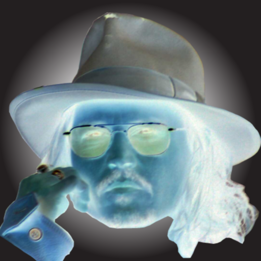

<div dir="rtl">
با تشکر از آقای "سید احمد داوود موسوی" که فایل و توضیحات کامل این سوال رو در اختیار من گذاشتن
</div>
@arman-ariamehr

<div dir="rtl">
جواب سوال 13:
  یک تصویر نگاتیو  را می خوانیم و سپس به تعداد مورد نظرمان، تصاویر نویز دار ایجاد می کنیم. در ادامه،میانگین پیسکل ها را در یک متغیر ذخیره کرده و با استفاده از آن، میانگین ها را در یک جدول ذخیره می کنیم. با اجرای برنامه، جدول به صورت خودکار در مسیری که مشخص کردیم ساخته می شود:
</div>

<div dir="rtl">
عکس نگاتیو ورودی:
</div>


```
input_im = imread('C:\Users\PC\Desktop\jd.png');
if size(input_im , 3) == 3
    image = rgb2gray(input_im);
else
    image = input_im;
end
amount = input('چه تعداد تصویر نویز دار می خواهید؟:');
chart = zeros(1,amount);
for i = 1 : amount 
    percent = rand;
    noise = imnoise(image , 'salt & pepper' , percent);
    avg = mean(mean(noise));
    chart(1,i) = avg;
    fid=fopen('C:\Users\PC\Desktop\1.csv','w');
fprintf(fid,'%6.1f',chart);
end
fclose(fid);
t=readtable('C:\Users\PC\Desktop\1.csv');
```

<div dir="rtl">
با تایپ حرف t در کامند ویندو، جدول را می توانید مشاهده کنید. 
</div>
 
 <div dir="rtl">
خروجی کد برنامه بالا برای 5 تصویر نویز دار به صورت زیر بود: 
</div>


