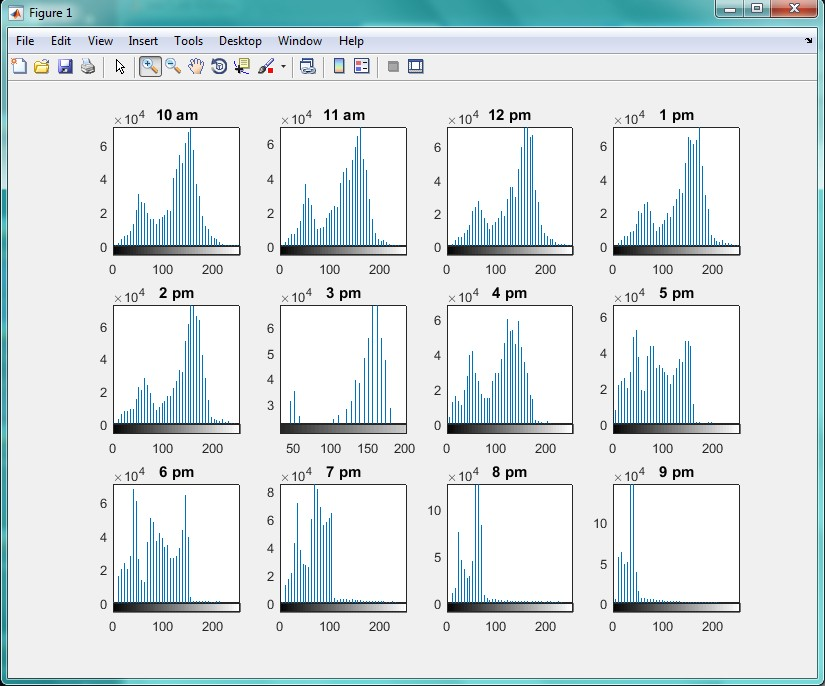

<div dir="rtl">
جواب سوال 14:
  صورت سوال: یک دیتاست تصویری از 12 ساعت مختلف یک شبانه روز ایجاد کنید و این تصاویر را به grayscale تبدیل کنید و هیستوگرام هر کدام را با یکدیگر مقایسه کنید.
</div>

<div dir="rtl">
در این قسمت، 12 تصویری که از ساعت های مختلف شبانه روز تهیه کردیم را در متغیر های جدا قرار داده و آن ها را به تصاویر خاکستری تبدیل می کنیم:
</div>

```
a = imread('C:\Users\PC\Desktop\10 am.jpg');
a=rgb2gray(a);
b = imread('C:\Users\PC\Desktop\11 am.jpg');
b=rgb2gray(b);
c = imread('C:\Users\PC\Desktop\12 pm.jpg');
c=rgb2gray(c);
d = imread('C:\Users\PC\Desktop\1 pm.jpg');
d=rgb2gray(d);
e = imread('C:\Users\PC\Desktop\2 pm.jpg');
e=rgb2gray(e);
f = imread('C:\Users\PC\Desktop\3 pm.jpg');
f=rgb2gray(f);
g = imread('C:\Users\PC\Desktop\4 pm.jpg');
g=rgb2gray(g);
h = imread('C:\Users\PC\Desktop\5 pm.jpg');
h=rgb2gray(h);
i = imread('C:\Users\PC\Desktop\6 pm.jpg');
i=rgb2gray(i);
j = imread('C:\Users\PC\Desktop\7 pm.jpg');
j=rgb2gray(j);
k = imread('C:\Users\PC\Desktop\8 pm.jpg');
k=rgb2gray(k);
l = imread('C:\Users\PC\Desktop\9 pm.jpg');
l=rgb2gray(l);
```

<div dir="rtl">
در ادامه، برای نمایش هیستوگرام تمامی تصاویر در یک صفحه به صورت یکجا، از دستور subplot استفاده می کنیم و از آنجایی که 12 هیستوگرام داریم، مقدار آن را 3 در 4 در نظر می گیریم:
</div>

```
figure;
subplot(3,4,1)
imhist(a,45)
title('10 am')
subplot(3,4,2)
imhist(b,45)
title('11 am')
subplot(3,4,3)
imhist(c,45)
title('12 pm')
subplot(3,4,4)
imhist(d,45)
title('1 pm')
subplot(3,4,5)
imhist(e,45)
title('2 pm')
subplot(3,4,6)
imhist(f,45)
title('3 pm')
subplot(3,4,7)
imhist(g,45)
title('4 pm')
subplot(3,4,8)
imhist(h,45)
title('5 pm')
subplot(3,4,9)
imhist(i,45)
title('6 pm')
subplot(3,4,10)
imhist(j,45)
title('7 pm')
subplot(3,4,11)
imhist(k,45)
title('8 pm')
subplot(3,4,12)
imhist(l,45)
title('9 pm')
```

<div dir="rtl">
خروجی کد بالا به صورت زیر است:
همانطور که مشاهده می کنید، هیستوگرام تصویر در شب، در نقطه صفر تجمع بیشتری دارد و این به این معنی است که رنگ ها در شب تیره تر هستند. هیستوگرام تصویر در اوایل صبح نیز پخش تر است. این به این معنی است که در طول روز، طیف رنگ های بیشتری داریم(خاکستری)
</div>


