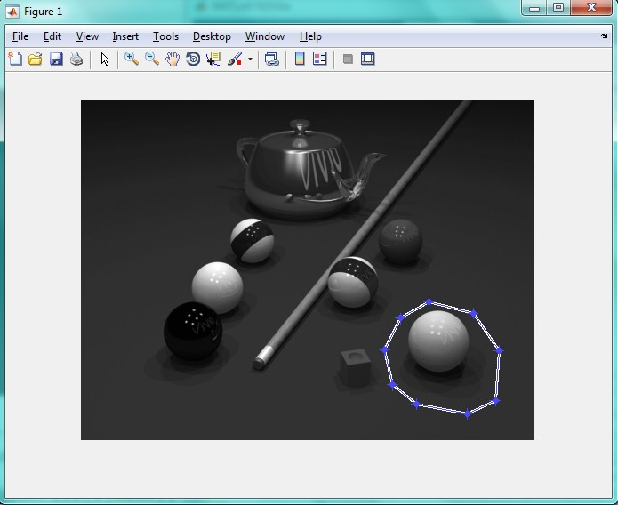
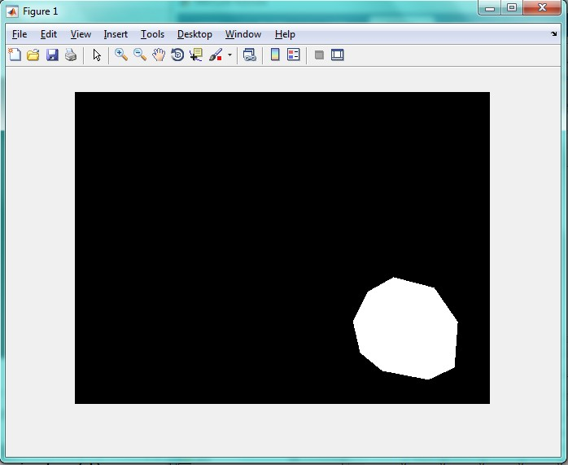
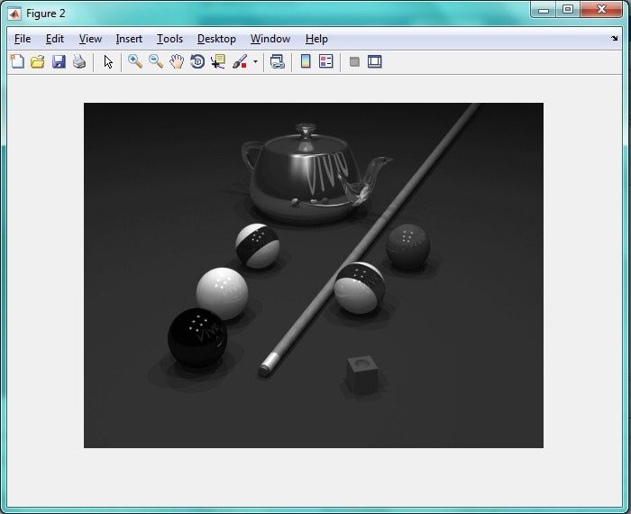

<div dir="rtl">
جواب سوال 15:
 تصویر اصلی به صورت زیر است. می خواهیم توپ طرد را از تصویر حذف کنیم بدون اینکه تغییری در پس زمینه آن ایجاد شود. برای این کار از ابزار roi استفاده میکنیم. بدین صورت که پس از اجرای برنامه، در اطراف توپ زرد کلیک چپ می کنیم تا به نقطه اول برگردیم. پس از تنظیم محدوده، دابل کلیک میکنیم تا ماسک ساخته شود و توپ زرد حذف شود:
</div>


```
a=imread('C:\Users\PC\Desktop\pool.png');
b=rgb2gray(a);
mask=roipoly(b);
imshow(mask);
j=regionfill(b,mask);
figure;
imshow(j);
```

<div dir="rtl">
دور تسویر به صورت زیر محدوده را تعیین کردیم:
</div>



<div dir="rtl">
خروجی برنامه به صورت زیر است:
</div>




