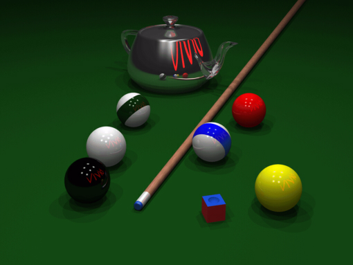
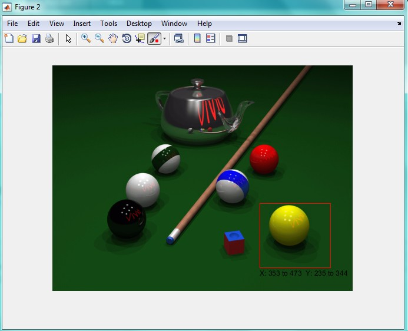
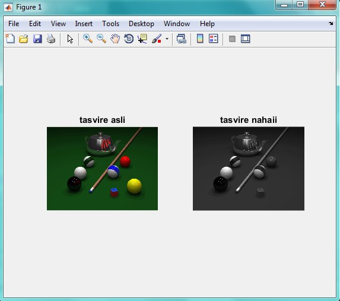

<div dir="rtl">
جواب سوال 15: 
 صورت سوال:ابتدا تصویر pool.png را به grayscale تبدیل کنید و سپس توپ زرد را از تصویر حذف کنید.
 
برای حل این سوال از دو تکنیک استفاده کردیم. تکنیک اول استفاده از  یکی از ابزار های متلب است که به صورت زیر است:

 تصویر اصلی به صورت زیر است. می خواهیم توپ زرد را از تصویر حذف کنیم بدون اینکه تغییری در پس زمینه آن ایجاد شود. در تکنیک اول از ابزار roi استفاده میکنیم. بدین صورت که پس از اجرای برنامه، در اطراف توپ زرد کلیک چپ می کنیم تا به نقطه اول برگردیم. پس از تنظیم محدوده، دابل کلیک میکنیم تا ماسک ساخته شود و توپ زرد حذف شود:
</div>



```
a=imread('C:\Users\PC\Desktop\pool.png');   % وارد کردن تصویر ورودی
b=rgb2gray(a);  % تبدیل آن به تصویر خاکستری
mask=roipoly(b); % ساخت ماسک با استفاده از تابع roipoly
imshow(mask);
j=regionfill(b,mask);
figure;
imshow(j);
```

<div dir="rtl">
دور تصویر به صورت زیر محدوده را تعیین کردیم:
</div>


<div dir="rtl">
خروجی برنامه به صورت زیر است:
</div>


<div dir="rtl">
برای حل با تکنیک دوم، از مختصات توپ زرد کمک می گیریم. با تشکر از آقای امید غلامی برای ارائه کد و توضیحات خوبشون
 
@omidgholami74
 
در تکنیک دوم. ابتدا مختصات توپ زرد را در تصویر به صورت حدودی پیدا میکنیم:
</div>



<div dir="rtl">
سپس یک دایره با مرکز مختصات حدودی خودمان تعریف کرده و آن را به رنگ خاکستری در می آوریم و روی توپ زرد می اندازیم. کد این قسمت به صورت زیر است:
</div>

```
image =imread('C:\Users\PC\Desktop\pool.png');
subplot(1,2,1) 
imshow(image);
title 'tasvire asli'
image =rgb2gray(image);
ball=[400 290 60]
image = insertShape(image,'FilledCircle',ball,...
    'Color',[49 49 49],'Opacity',1);
subplot(1,2,2)
imshow(image);
title 'tasvire nahaii'
```

<div dir="rtl">
تصویر خروجی به صورت زیر بود:
</div>


