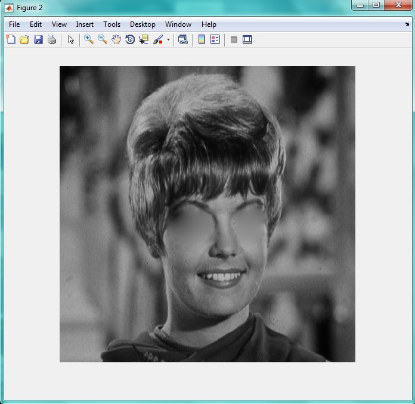

<div dir="rtl">
جواب سوال 16:
برای حذف چشمان تصویر، از همان دستور قبل استفاده شده با این تفاوت که دستور roi دو بار اجرا می شود (هر بار برای یکی از چشم ها).
</div>

```
a=imread('C:\Users\PC\Desktop\zelda.png');
mask=roipoly(a);
imshow(mask);
j=regionfill(a,mask);
mask2=roipoly(j);
imshow(mask2);
k=regionfill(j,mask2);
figure;
imshow(k);
```
<div dir="rtl">
خروجی به صورت زیر است:
</div>


