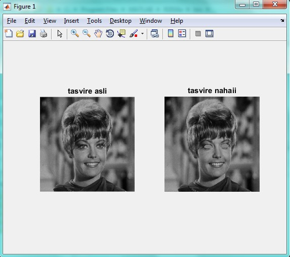

<div dir="rtl">
جواب سوال 16:
  صورت سوال: چشم های تصویر zelda.png را حذف کنید.
  برای حل این سوال از دو تکنیک استفاده می کنیم. تکنیک اول به این صورت است که برای حذف چشم ها، دو بار از دستور roi استفاده می شود (یعنی برای هر چشم یکبار). 
</div>

```
addpath("../../../benchmark/");
a=imread("zelda.png");                           % تصویر را درون متغیر قرار می دهیم
mask=roipoly(a);                                 % برای یکی از چشمان تصویر، یک ماسک درست می کنیم
imshow(mask);                                    % ماسک را نمایش می دهیم
j=regionfill(a,mask);                            % درون ماسک را با رنگ اطرافش پوشش می دهیم و تصویر جدید را درون متغیر دیگری قرار می دهیم
mask2=roipoly(j);                                % دور چشم دیگر ماسک می کشیم
imshow(mask2);                                   % ماسک را نمایش می دهیم
k=regionfill(j,mask2);                           % درون ماسک را با رنگ اطرافش پوشش می دهیم
figure;
imshow(k);                                       % تصویر نهایی را نمایش می دهیم
```

<div dir="rtl">
خروجی به صورت زیر است:
</div>


<div dir="rtl">
  با تشکر از آقای امید غلامی برای ارائه کد و توضیح تکنیک دوم:

در تکنیک دوم، از مختصات دور چشم کمک گرفتیم. به این صورت که با استفاده از ابزاری که در تصویر زیر مشاهده می کنید، مختصات 6 نقطه دور چشم را برای هر چشم یادداشت کرده تا
یک چند ضلعی روی چشم درست کنیم، و رنگ آن قسمت را به رنگ خاکستری در می آوریم.
من برای حل این سوال از 6 نقطه کمک گرفتم. درصورتی که دقت بیشتری لازم دارید، باید از نقاط بیشتری کمک بگیرید:

</div>


```
addpath("../../../benchmark/");
image =imread("zelda.png");                                                      % تصویر را از آدرس مورد نظر خوانده و درون یک متغیر قرار می دهیم
subplot(1,2,1)
imshow(image);                                                                   % تصویر اصلی را با عنوان خودش، در سمت چپ تصویر خروجی نمایش می دهیم
title 'tasvire asli'
eye_left=[212 272 221 277 233 280 245 279 259 273 251 263 234 258 220 262 ];     % مختصات 6 نقطه در اطراف چشم چپ را مشاهده می کنید. هر جفت مولفه نشان گر طول و عرض نقطه می باشد. برای مثال جفت اول، برای نقطه اول؛ جفت دوم برای نقطه دوم و ...
eye_right=[303 267 314 275 327 277 338 274 348 265 336 255 325 254 311 258];     % مختصات 6 نقطه در اطراف چشم راست
colorCode=140;
image = insertShape(image,'FilledPolygon',{eye_left,eye_right},...               % درون چشم چپ و راست را با یک رنگ خاکستری، نزدیک به رنگ گونه ها پر می کنیم
    'Color',[130 130 130],'Opacity',1);

subplot(1,2,2)                                                                   % تصویر نهایی را در سمت راست تصویر خروجی نمایش می دهیم
imshow(image);
title 'tasvire nahaii'
```

<div dir="rtl">
تصویر خروجی به صورت زیر است:
</div>


