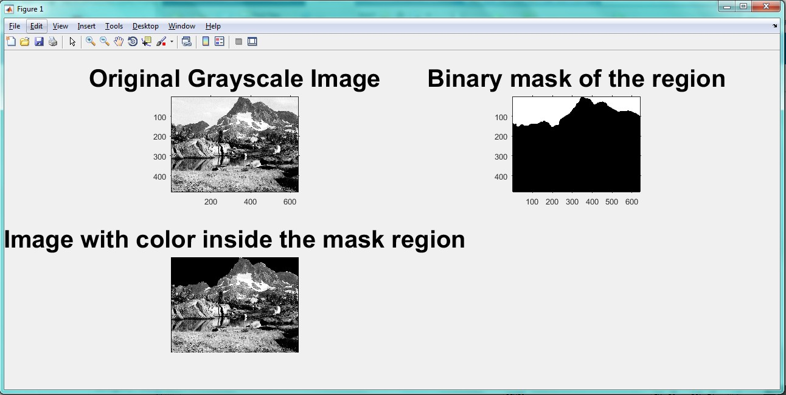

<div dir="rtl">
جواب سوال 17:
  برای سیاه کردن آسمان،یک ماسک باینری می سازیم و درون ماسک را به رنگ سیاه در می آوریم. از آنجایی که تصویر کوهستان خاکستری است، ابتدا آن را رنگی می کنیم و رنگ درون ماسک را به انتخاب سه مولفه rgb مشکی می کنیم
</div>

```
input=imread('C:\Users\PC\Desktop\1.jpg');
subplot(1,2,1), imshow(input), title('RGB Scale image');
[x,y,~] = size(input);

for i = 1:1:x
   for j = 1:1:y
      output(i,j) = 0.40*input(i,j,1) + 0.50*input(i,j,2) + 0.30*input(i,j,3);
   end
end

subplot(1,2,2), imshow(output), title('Gray Scale  image')
```

<div dir="rtl">
خروجی کد برنامه بالا به صورت زیر است:
</div>


