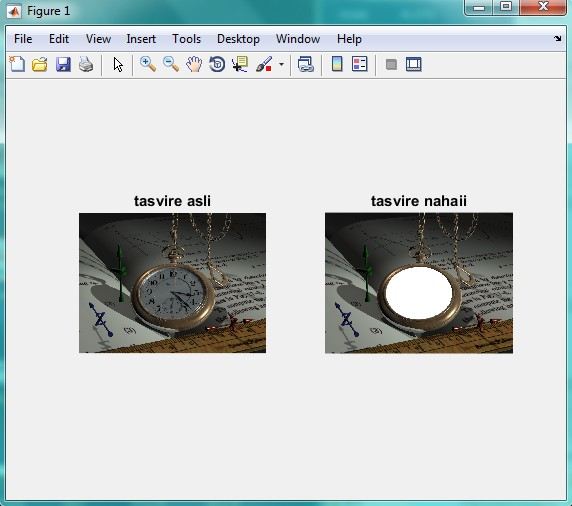

<div dir="rtl">
جواب سوال 18:
  در صورتی که هدف از سوال، سفید کردن کل صفحه ساعت باشد، می توانیم از دو تکنیک استفاده کنیم. تکنیک اول استفاده از ماسک است:
  برای این منظور، پس از اجرای کد زیر، محدوده ساعت را به صورت دستی مشخص کرده تا درون آن سفید شود:
</div>

```
addpath("../../../benchmark/");
a = imread("watch.png");
[rows, columns, numberOfColorChannels] = size(a);
imshow(a, []);
axis on;
title('تصویر اصلی', 'FontSize', 15);
set(gcf, 'Position', get(0,'Screensize')); % baraye bozorg kardane tasvir.
message = sprintf('Left click and hold to begin drawing.\nSimply lift the mouse button to finish');
uiwait(msgbox(message));
hFH = imfreehand();
% sakhte yek tasvire binary ("mask") az tarighe ROI.
binaryImage = hFH.createMask();
xy = hFH.getPosition;
% koochaktar kardane tasvir.
subplot(2, 2, 1);
imshow(a, []);
axis on;
drawnow;
title('تصویر اصلی', 'FontSize', 15);
% namayeshe mask.
subplot(2, 2, 2);
imshow(binaryImage);
axis on;
title('تصویر ماسک', 'FontSize', 15);
% agar tasvir grayscale ast, be rangi tabdil kon
if numberOfColorChannels < 3
  rgbImage = cat(3, a, a, a);
else
  % hal tasvire rangi darim.
  rgbImage = a;
end
% kanale rang haye ghermez sabz va abi ra estekhraj kon.
redChannel = rgbImage(:, :, 1);
greenChannel = rgbImage(:, :, 2);
blueChannel = rgbImage(:, :, 3);
% rangi ke mikhahim be aseman bedahim ra moshakhas kon.
desiredColor = [255, 255, 255]; % sefid
redChannel(binaryImage) = desiredColor(1);
greenChannel(binaryImage) = desiredColor(2);
blueChannel(binaryImage) = desiredColor(3);
% kanal haye rangi motefavet ra be ham motasek kon.
rgbImage = cat(3, redChannel, greenChannel, blueChannel);
% tasvir ra namayesh bede.
subplot(2, 2, 3);
imshow(rgbImage);
title('تصویر تغییر یافته', 'FontSize', 15);
```

<div dir="rtl">
خروجی کد برنامه بالا به صورت زیر است:
</div>


<div dir="rtl">
در تکنیک دوم، مختصات دور ساعت را با استفاده از ابزار متلب استخراج کرده، و درون کد قرار می دهیم تا درون آن به رنگ دلخواه ما (سفید) در بیاید:
</div>

```
addpath("../../../benchmark/");
image=imread("watch.png");
subplot(1,2,1)
imshow(image);
title 'tasvire asli'
saat=[354 508 368 526  388 545 415 561 440 572 464 578 492 582 524 582 557 577 591 567 624 551 654 528 680 496 692 460 694 425 687 400 662 358 633 331 591 310 552 298 503 296 462 304 424 315 393 334 366 356 350 379 337 406 332 434 333 460 342 486];

colorCode=140;
image = insertShape(image,'FilledPolygon',{saat},'Color',[255 255 255],'Opacity',1);

subplot(1,2,2)
imshow(image);
title 'tasvire nahaii'
```

<div dir="rtl">
خروجی کد برنامه بالا به صورت زیر است:
</div>


