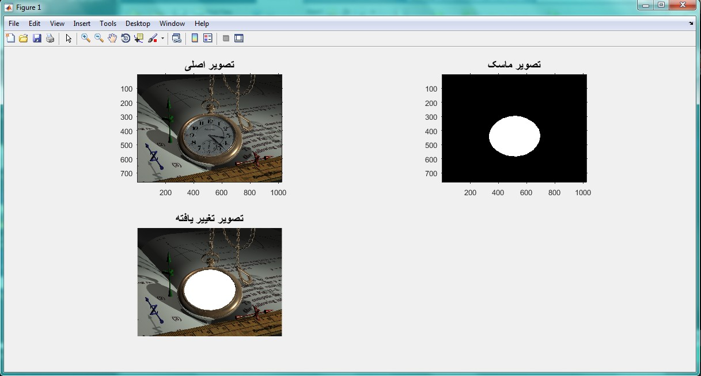
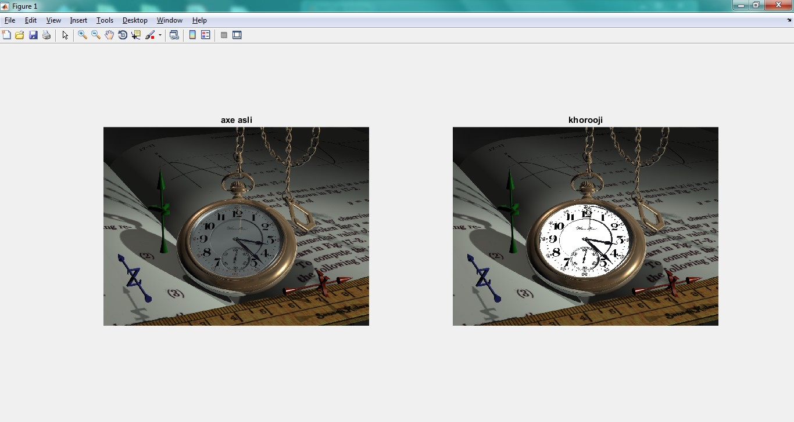

<div dir="rtl">
جواب سوال 18:
  در صورتی که هدف از سوال، سفید کردن کل صفحه ساعت باشد، می توانیم از دستور زیر استفاده کنیم:
</div>

```
a = imread('C:\Users\PC\Desktop\watch.png');
[rows, columns, numberOfColorChannels] = size(a);
imshow(a, []);
axis on;
title('تصویر اصلی', 'FontSize', 15);
set(gcf, 'Position', get(0,'Screensize')); % baraye bozorg kardane tasvir.
message = sprintf('Left click and hold to begin drawing.\nSimply lift the mouse button to finish');
uiwait(msgbox(message));
hFH = imfreehand();
% sakhte yek tasvire binary ("mask") az tarighe ROI.
binaryImage = hFH.createMask();
xy = hFH.getPosition;
% koochaktar kardane tasvir.
subplot(2, 2, 1);
imshow(a, []);
axis on;
drawnow;
title('تصویر اصلی', 'FontSize', 15);
% namayeshe mask.
subplot(2, 2, 2);
imshow(binaryImage);
axis on;
title('تصویر ماسک', 'FontSize', 15);
% agar tasvir grayscale ast, be rangi tabdil kon
if numberOfColorChannels < 3
  rgbImage = cat(3, a, a, a);
else
  % hal tasvire rangi darim.
  rgbImage = a;
end
% kanale rang haye ghermez sabz va abi ra estekhraj kon.
redChannel = rgbImage(:, :, 1);
greenChannel = rgbImage(:, :, 2);
blueChannel = rgbImage(:, :, 3);
% rangi ke mikhahim be aseman bedahim ra moshakhas kon.
desiredColor = [255, 255, 255]; % sefid
redChannel(binaryImage) = desiredColor(1);
greenChannel(binaryImage) = desiredColor(2);
blueChannel(binaryImage) = desiredColor(3);
% kanal haye rangi motefavet ra be ham motasek kon.
rgbImage = cat(3, redChannel, greenChannel, blueChannel);
% tasvir ra namayesh bede.
subplot(2, 2, 3);
imshow(rgbImage);
title('تصویر تغییر یافته', 'FontSize', 15);
```

<div dir="rtl">
خروجی کد برنامه بالا به صورت زیر است:
</div>



<div dir="rtl">
 اگر هدف از سوال، سفید کردن بک گراند ساعت (به جز اعداد و عقربه ها) باشد، می توانیم از دستور زیر استفاده کنیم:
</div>

<div dir="rtl">
با تشکر از آقای "علیرضا چاجی" بابت در اختیار گذاشتن کد این قسمت از سوال
</div>
@alirezachaji

```
close all
clear all
clc
pic = imread('C:\Users\PC\Desktop\watch.png');
subplot(1,2,1), imshow(pic), title('axe asli');
k=5;
for i=300:585
    for j=300:720
        r=pic(i,j,1);
        g=pic(i,j,2);
        b=pic(i,j,3);
        if(r-g<k)&&(r-b<k)&&(g-b<k)
            if(r>10)&&(g>35)&&(b>75)
                pic(i,j,:)=255;
            end
        end
    end
end    

subplot(1,2,2), imshow(pic), title('khorooji');
© 2021 GitHub, Inc.
```

<div dir="rtl">
خروجی کد برنامه بالا به صورت زیر است:
</div>


