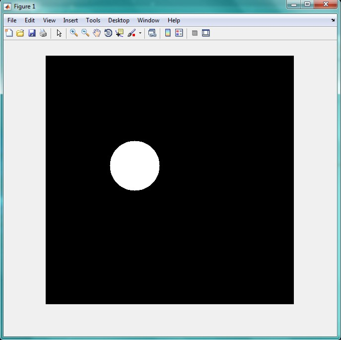

<div dir="rtl">
جواب سوال 2:
صورت سوال: برنامه ای بنویسید که یک عدد را به عنوان شعاع دایره و یه عدد را به عنوان مکان رسم دایره از بگیرد و در یک تصویر 1000 * 1000 پیکسل مشکی رنگ آن دایره را با رنگ سفید نمایش دهد.
کدی که برای حل این سوال نوشتیم به این صورت است:
ابتدا یه متفیر با نام A تعریف می کنیم که یک ماتریس یا تصویر 1000 در 1000 است:
</div>

```
A=zeros(1000,1000);
```
<div dir="rtl">
در ادامه از کاربر، شعاع و مختصات مرکز دایره را به عنوان ورودی دریافت می کنیم:
</div>

```
r =input('shoaa ra vared konid='); %radius
x=input('x markaze dayere ra vared konid=');
y=input('y markaze dayere ra vared konid=');
```
<div dir="rtl">
x و y ای که به عنوان مرکز دایره از ورودی دریافت کردیم را درون متغیری با نام m می ریزیم:
</div>

```
m = {x,y}; %midpoint
```

<div dir="rtl">
در ادامه، با استفاده از تابع رسم دایره، آن را روی صفحه A رسم می کنیم:
</div>

```
A(m{:})=1;
B = bwdist(A) <= r;
imshow(B)
```

<div dir="rtl">
  خروجی کد بالا به صورت زیر است: 
</div>


