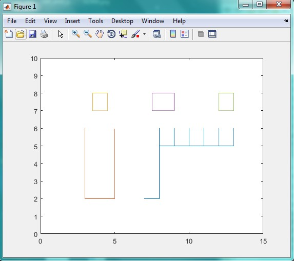

<div dir="rtl">
جواب سوال 20:
</div>

```
x=[7 8 8 8 9 9 9 10 10 10 11 11 11 12 12 12 13 13 ];
y=[2 2 6 5 5 6 5 5 6 5 5 6 5 5 6 5 5 6 ];
m=[3 3 5 5];
n=[6 2 2 6];
q=[3.5 4.5 4.5 3.5 3.5];
w=[7 7 8 8 7];
r=[7.5 9 9 7.5 7.5];
t=[7 7 8 8 7];
u=[12 13 13 12 12];
i=[7 7 8 8 7];
plot(x,y,m,n,q,w,r,t,u,i);
axis([0 15 0 10]);
```

<div dir="rtl">
خروجی کد برنامه بالا به صورت زیر است:
</div>



