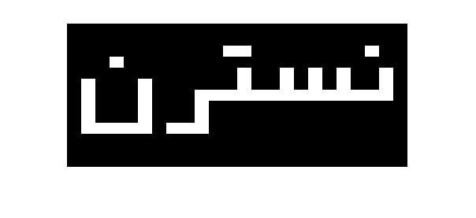

<div dir="rtl">
جواب سوال 20:
</div>

<div dir="rtl">
هر کدام از ماتریس هایی که حاوی اعداد 0 و 1 هستند را برای یک حرف در نظر گرفتیم. محل قرار گیری نقاط 1 نیز به همان صورتی بود که در شکل اسلی حروف قابل مشاهده است. نقاط 0 درون ماتریس ها رنگ سیاه دارند و نقاط 1 رنگ سفید:
</div>

```
n=[0,0,0,0;
   0,0,0,0;
   0,1,0,0;
   0,0,0,0;
   0,0,1,0;
   0,0,1,0;
   1,1,1,0;
   0,0,0,0;
   0,0,0,0;
   0,0,0,0;
   0,0,0,0;
   0,0,0,0;
   0,0,0,0];
s=[0,0,0,0,0,0;
   0,0,0,0,0,0;
   0,0,0,0,0,0;
   0,0,0,0,0,0;
   0,1,0,1,0,1;
   0,1,0,1,0,1;
   1,1,1,1,1,1;
   0,0,0,0,0,0;
   0,0,0,0,0,0;
   0,0,0,0,0,0;
   0,0,0,0,0,0;
   0,0,0,0,0,0;
   0,0,0,0,0,0];
t=[0,0,0,0;
   0,0,0,0;
   0,1,1,0;
   0,0,0,0;
   0,0,1,0;
   0,0,1,0;
   1,1,1,1;
   0,0,0,0;
   0,0,0,0;
   0,0,0,0;
   0,0,0,0;
   0,0,0,0;
   0,0,0,0;];
r=[0,0,0,0;
   0,0,0,0;
   0,0,0,0;
   0,0,0,0;
   0,0,0,0;
   0,0,0,0;
   0,0,0,1;
   0,0,0,1;
   0,0,0,1;
   0,1,1,1;
   0,0,0,0;
   0,0,0,0;
   0,0,0,0;];
n2=[0,0,0,0,0,0,;
   0,0,0,0,0,0,;
   0,0,0,0,0,0,;
   0,0,0,1,0,0,;
   0,0,0,0,0,0,;
   0,1,0,0,0,1,;
   0,1,0,0,0,1,;
   0,1,0,0,0,1,;
   0,1,0,0,0,1,;
   0,1,1,1,1,1,;
   0,0,0,0,0,0,;
   0,0,0,0,0,0,;
   0,0,0,0,0,0,];
```
  
<div dir="rtl">
در ادامه، تمام حروف را برعکس ترتیب نمایششان، به هم متصل می کنیم:
</div>

```
image=cat(2,n2,r,t,s,n);
image=repelem(image,14,18);
imshow(image)
```

<div dir="rtl">
خروجی کد برنامه بالا به صورت زیر است:
</div>



