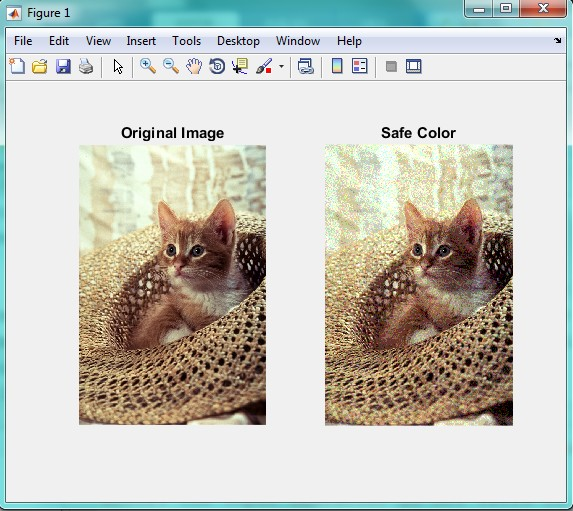

<div dir="rtl">
جواب سوال 21:
برای این کار، از روش زیر استفاده می کنیم:
</div>

<div dir="rtl">
ابتدا یک متغیر تعریف می کنیم و مقدار آن را بین 0 و 1 قرار می دهیم
</div>

```
colorValues = (0:0.199:1).';  %'
```

<div dir="rtl">
سپس با استفاده از دستور rempat ماتریسی با متغیر تعریف شده می سازیم که 36 سطر و یک ستون دار 
تابع kron نیز از ماتریس اولیه، یک ماتریس با همان ضرایب می سازد
</div>

```
webSafeMap = [repmat(colorValues,36,1) ...
              kron(colorValues,ones(36,1)) ...
              repmat(kron(colorValues,ones(6,1)),6,1)];
```

<div dir="rtl">
تصویر را وارد میکنیم:
</div>

```
addpath("../../../benchmark/");
imageRGB = imread("cat.png"); 
```

<div dir="rtl">
با استفاده از دستور rgb2ind تصویر رنگی را به تصویر اسندکس شده برمیگردانیم و با استفاده از دستور ind2rgb دوباره آن را رنگی می کنیم:
</div>

```
imageRGB2 = ind2rgb(rgb2ind(imageRGB,webSafeMap),webSafeMap);
```

<div dir="rtl">
برای نمایش تصویر خروجی، از دستور subplot استفاده می کنیم:
</div>

```
subplot(1,2,1);imshow(imageRGB);
title('Original Image');
subplot(1,2,2);imshow(imageRGB2);
title('Safe Color');
```
<div dir="rtl">
تصویر خروجی به صورت زیر است:
</div>


