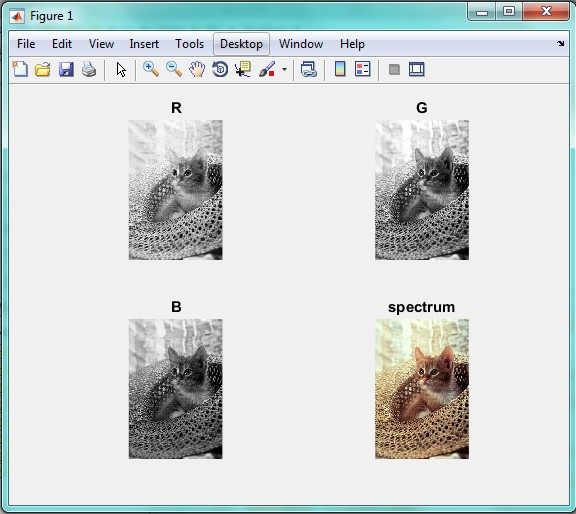
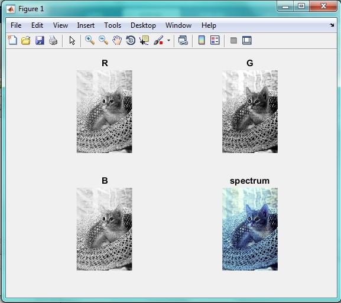

<div dir="rtl">
جواب سوال 22:
  برای تعویض کانال های رنگی قرمز و آبی، به صورت زیر عمل می کنیم:
  ابتدا تصویر را وارد کرده:
</div>

```
addpath("../../../benchmark/");
spectrum = imread("cat.png");
```

<div dir="rtl">
تصویر ورودی به همراه کانال هایش به صورت زیر است:
</div>



<div dir="rtl">
با استفاده از دستورات زیر، جای کانال های قرمز و آبی را عوض می کنیم:
</div>

```
R=spectrum(:,:,1);
spectrum(:,:,1)=spectrum(:,:,3);
spectrum(:,:, 3)=R;
```

<div dir="rtl">
حال کانال های تعویض شده به همراه تصویر خروجی را نمایش می دهیم:
</div>

```
subplot(2,2,1)
B=spectrum(:,:, 3);
G=spectrum(:,:, 2);
imshow(R);
title('R');
subplot(2,2,2)
imshow(G);
title('G');
subplot(2,2,3)
imshow(B);
title('B');
subplot(2,2,4)
imshow(spectrum);
title('spectrum');
```

<div dir="rtl">
تصویر خروجی به صورت زیر است:
</div>


