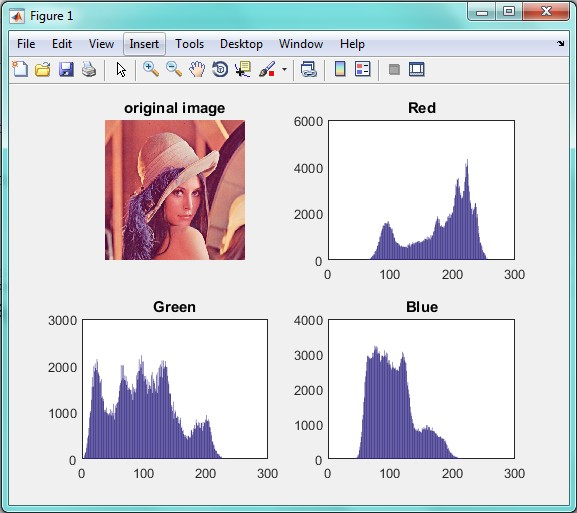

<div dir="rtl">
با تشکر از آقای غلامی بابت در اختیار گذاشتن کد
</div>
@omidgholami74

<div dir="rtl">
جواب سوال 23:
ابتدا تصویر را از ورودی دریافت می کنیم:
</div>

```
clc;
close all;
clear all;

addpath("../../../benchmark/");
pic = imread("lena.png");
```

<div dir="rtl">
سپس بااستفاده از دستورات زیر، تابع را فراخوانی کرده و نمودار هیستوگرامش را نمایش می دهیم:
</div>

```
subplot(2,2,1);imshow(pic);title('original image')
hisR=his(pic,1);
hisG=his(pic,2);
hisB=his(pic,3);
 subplot(2,2,2);bar(hisR);title('Red')
 subplot(2,2,3);bar(hisG);title('Green')
 subplot(2,2,4);bar(hisB);title('Blue')
```
<div dir="rtl">
تابع هستوگرام به صورت زیر است. با استفاده از دستور size ابعاد تصویر را در یک آرایه ریخته و از مختصات x و y آن برای ایجاد یک حلقه و رمحاسبه هیستوگرام استفاده می کنیم:
</div>

```
function image = his(pic,n)
his=zeros(1,255);
[h,w,k] = size(pic);
    for i=1:h
        for j=1:w
            his(1,pic(i,j,n))=his(1,pic(i,j,n))+1;
        end
    end
    image =his;
end
```

<div dir="rtl">
تصویر خروجی به صورت زیر است:
</div>


