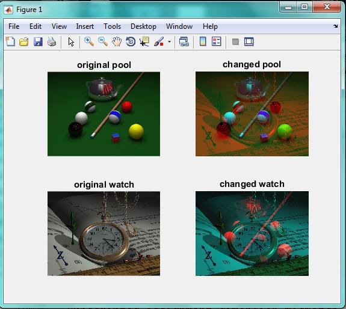

<div dir="rtl">
 با تشکر از آقای علیرضا چاجی 
</div>

<div dir="rtl">
جواب سوال 24:
  ابتدا تصاویر را از ورودی می خوانیم و از آنجایی که سایز دو تصویر یکسان نیست، سایز تصویر pool را به اندازه تصویر watch در می آوریم.
تصاویر اصلی را نیز با استفاده از تابع subplot نمایش می دهیم:
</div>

```
addpath("../../../benchmark/");
pool = imread("pool.png");
pool=imresize(pool,[768 1024]);
subplot(2,2,1)
imshow(pool);
title('original pool');
addpath("../../../benchmark/");
watch = imread("watch.png");
subplot(2,2,3)
imshow(watch);
title('original watch');
```

<div dir="rtl">
با استفاده از دستورات زیر، کانال های قرمز تصاویر را با هم جا به جا می کنیم و در انتخا، هر کدام از آن ها را نمایش می دهیم:
</div>

```
pg=pool(:,:,1);
wg= watch(:,:,1);
watch(:,:,1)=pg;
pool(:,:,1)=wg;
subplot(2,2,2)
imshow(pool);
title('changed pool');
subplot(2,2,4)
imshow(watch);
title('changed watch');
```

<div dir="rtl">
تصویر خروجی به صورت زیر خواهید بود:
</div>


