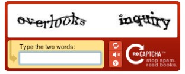
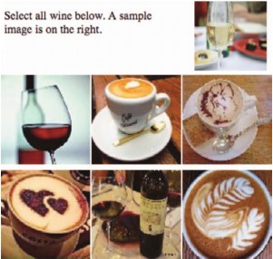
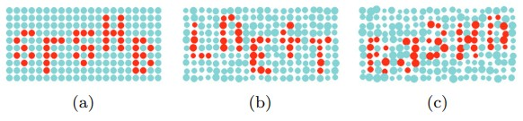
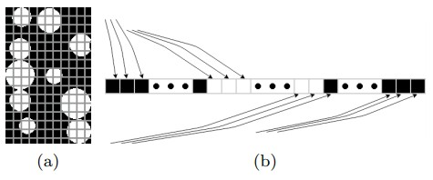

<div dir="rtl">
  
  # شناسایی کاراکتر های CAPTCHA توسط الگوریتم های یادگیری ماشین نظارت شده
<br/>

###### Ondrej Bostik - Jan Klecka
<br/>

###### گروه کنترل و ابزار دقیق، دانشگاه فناوری برنو، برنو، جمهوری چک 


(e-mail: bostik,klecka@feec.vutbr.cz)
<br/>

****
 


#### چکیده: تمرکز این مقاله بر روی مقایسه چندین الگوریتم طبقه بندی معمول یادگیری ماشین، برای تشخیص کاراکتر بصری کدهای CAPTCHA است. بخش اصلی این تحقیق بر روی مطالعه تطبیقی شبکه های عصبی، k نزدیکترین همسایه، ماشین های بردار پشتیبان و درخت تصمیم گیری پیاده سازی شده در محیط محاسباتی MATLAB متمرکز است. نرخ دستیابی به موفقیت در همه الگوریتم های تجزیه و تحلیل شده بالاتر از 89٪ بود. تفاوت اصلی در نتایج الگوریتم های استفاده شده، در زمان یادگیری است.
<br/>

****
 
## 1. مقدمه
<br/>

#### به سختی می‌توان شاخه دیگری از ارتقای Cybernetics (فرمان شناسی) را یافت که به سرعت و پشتکار بینایی رایانه برسد. تکنیک‌ها، روش‌ها و الگوریتم های بینایی رایانه، طیف وسیعی از کارهای ترافیکی، صنعتی و سایر کارهایی را که برای سنجش بینایی در نظر گرفته شده است را حل می‌کنند. 
 در اوایل ظهور فناوری های بینایی رایانه، در صنایع تنها کارهای ساده پردازش تصویر انجام می‌شد. در آن زمان، معمولاً بررسی حضور، ابعاد یا رنگ محصول داده شده مورد بررسی قرار می‌گرفت. به مروز زمان، این نوع بازرسی های صنعتی در صنایع غذایی (به عنوان مثال برای بررسی بطری های شیشه‌ای، تجزیه و تحلیل مواد بصری (به عنوان مثال طبقه بندی بصری سیم های فولادی) و ..) جای خود را محکم کردند. سیستم های نظارت بر ترافیک و تخلف همراه با سیستم های به اصطلاح ADAS، دومین کلاس اصلی برنامه های بینایی رایانه است. در حال حاضر، نمونه مناسبی از سیستم های نظارت بر ترافیک برای تخمین صف ترافیک را می‌توانید در بسیاری از کشور‌ها مشاهده کنید. علاوه بر صنعت و ترافیک، در کار‌ها و حوزه های زیادی از ابزار پردازش تصویر استفاده می‌شود. بازسازی صحنه سه بعدی برای رباتیک در محیط های بیرونی و داخلی به طور گسترده‌ای مورد استفاده قرار می‌گیرد. به عنوان مثال، اخیراً محققان یک رویکرد جدید برای بازسازی استریو بدون کالیبره را معرفی کردند.
<br/>

#### جای تعجب نیست که بینایی ماشین یا رایانه، تنها در شاخه های مهندسی نیست که به عنوان یک ابزار مشکل گشا استفاده می‌شود. بسیاری از کاربردهای جالب پردازش تصویر و به ویژه روش های بازیابی تصویررا می‌توانید در IT و شاخه های امنیت اینترنت مشاهده کنید. یکی از کاربردهای مختلف پردازش تصویر که اخیرا معرفی شده است در امنیت اینترنت است. مفهومی ‌معروف به نام Captcha وجود دارد که به عنوان نوعی آزمون تورینگ شناخته می‌شود. در فصل های بعدی، به استفاده از روش های بینایی رایانه و یادگیری ماشین در شناسایی خودکار Captcha می‌پردازیم.


<br/>


### 1.1 مفهوم CAPTCHA
<br/>

#### ناشناس بودن سرویس های وب، معمولاً به وضعیتی منجر می‌شود که برای انجام کارهای یکنواخت، برنامه های رایانه‌ای را جایگزین انسان کنیم. چنین برنامه‌ها و سرویس های خودکاری می‌توانند در کسری از دقیقه، تعداد زیادی ایمیل ناخواسته ارسال کنند، برای جستجوی اطلاعات در پایگاه های عمومی ‌جستجو کنند و یا بر مجموعه‌ها و استخر های آنلاین تأثیر بگذارند.
 در 20 سال گذشته، تحقیقات زیادی در رابطه با این مشکل منتشر شده است. CAPTCHA (مخفف کلمه: آزمون کاملاً خودکار تورینگ عمومی‌ برای تشخیص رایانه از انسان) به عنوان یک کار کلی تعریف می‌شود که حل آن برای انسان بسیار آسان است، اما ایجاد ماشین یا برنامه‌ای که وظیفه دیگری به جز خواندن کپچا دارد، کاری سخت و دشوار است. 


<br/>

### 1.2 CAPTCHA مبتنی بر متن
<br/>

#### رایج ‌ترین رویکرد مورد استفاده برای پیاده سازی Captcha برای سرویس های وب، مبتنی بر مسئله OCR (تشخیص کاراکتر بصری) است. الگوریتم های OCR فعلی می‌توانند بسیار قوی باشند، اما ضعف هایی هم دارند. این نقص‌ها، استفاده از این الگوریتم‌ها را محدود می‌کند اما می‌تواند برای خواندن و تشخیص Captcha مزیت های زیادی داشته باشند. 
 سرور، تصویر را با دنباله‌ای از کاراکتر‌ها به سمت مشتری ارسال می‌کند. این تصویر به روشی تهیه شده است که از مشکلات شناخته شده OCR در برابر رایانه، استفاده می‌کند. در عین حال، افرادی که سعی در حل این نوع چالش های Captcha به وسیله راه حل الگوریتمی ‌دارند، به بهبود الگوریتم های OCR کمک می‌کنند.
<br/>

#### این فرآیند تکرار به هر دو طرف کمک می‌کند، اما تا کنون توسعه و پیشرفت آن به جای بسیار خوبی نرسیده و طرح های فعلی Captcha برای کامپیوتر و انسان بسیار پیچیده است. البته بسیاری از چالش های کنونی Captcha بسیار پیچیده هستند، به طوری که بشر نیز نمی‌تواند برخی از آنها را حل کند، اما ماشین‌ها می‌توانند آن را حل کنند. سیستم های همه کاره خودکاری که برای دور زدن Captcha طراحی شده‌اند، می‌توانند بسیاری از طرح‌ها را بدون هیچ نوع تعامل انسانی پشت سر بگذارند. برخی از این سیستم‌ها را می‌توان برای یادگیری چالش ناشناخته Captcha اصلاح کرد. این نوع سیستم‌ها می‌توانند برای تشخیص تقریباً تمام طرح های ممکن Captcha، با موفقیت بالا عمل کنند.
 محققان چندین روش برای بهبود امنیت طرح های Captcha توصیه می‌کنند.
<br/>

#### اولین موردی که باید مورد استفاده قرار گیرد، استفاده از نوعی تکنیک ضد تجزیه سازی است. بسیاری از سیستم‌ها از خطوط محل تقاطع حروف استفاده می‌کنند؛ اما اشتباه رایج در استفاده از خطوط طولانی (طولانی‌تر از اندازه یک حرف) این است که ممکن است این خطوط، با استفاده از تبدیل هاف («تبدیل هاف»  Hough Transformتکنیکی است که به وسیله آن می‌توان خطوط راست و حتی اشکال دایره‌ای را در یک تصویر تشخیص داد) فیلتر شوند. ساده‌ترین روش، استفاده از طول کلمه کلیدی متغیر است که حدس زدن وضعیت حروف جداگانه را دشوارتر می‌کند.
<br/>

#### مرحله بعدی امنیت، مربوط به سطح کارکتر های منفرد است. استفاده از انواع فونت‌ها، اندازه‌ها و چرخش های مختلف، روش خوبی است. از طرف دیگر، استفاده از نویز تصادفی توصیه نمی‌شود زیرا الگوریتم های فعلی برای مدیریت نویز، نسبت به مغز انسان، مناسب ترند. همچنین استفاده از کاراکتر های مشابه مانند عدد 0، حرف O و D بزرگ توصیه نمی‌شود، چرا که در برخی شرایط، کامپیوتر یا انسان نمی‌توانند تفاوتی بین این‌ها قائل شوند.
<br/>

#### در چند سال گذشته، ایده بسیار جالبی به نام reCaptcha مطرح شد. کمی ‌بعد، توسعه این ایده در گوگل انجام شد. آمار‌ها نشان دادند که هر روزه حدود 100 میلیون چالش Captcha با زمان های مختلف از 5 تا 20 ثانیه، حل شده‌اند. اگر بخواهیم واقع بینانه نگاه کنیم، این کار ممکن بود که ما را به وضعیتی برساند که بشریت هر روز ده‌ها سال را برای حل طرح های Captcha هدر دهد.
 بر این اساس، محققان از خودشان پرسیدند که چگونه می‌توان این زمان را حفظ کرد؟ راه حل ساده است! بایگانی‌ها حاوی تعداد زیادی اسناد هستند که هنوز دیجیتالی نشده‌اند. سیستم اصلی reCaptcha (شکل 1 را ببینید) از دو قسمت تشکیل شده است. مرحله آماده سازی از دو الگوریتم OCR استفاده می‌کند که هر کدام سعی دارد مستندات ارسالی را به طور مستقل رونویسی کنند. سپس خروجی‌ها مقایسه می‌شوند. در مرحله بعد، قطعاتی که مطابقت داشتند به عنوان "به درستی حل شده" علامت گذاری می‌شوند. 
<br/>


<p align="center">
      
     <br> شکل 1. نمونه طرح متن reCaptcha سایت گوگل <br/>
</p>

 

### 1.3 CAPTCHA مبتنی بر تصویر
<br/>

#### روش دیگر ایجاد Captcha استفاده از تصاویر است که برای حل آن، فرد باید حدس بزند که از بین چندین تصویر، کدام یک از آن‌ها به موضوع مورد نظر اشاره دارند، یا اینکه چه تعداد شی مورد نظر در تصویر مشاهده می‌شود. این نوع آزمون Captcha کاربر پسندتر است و حل آن آسان‌تر از Captcha متنی است.
یک مثال عالی از طرح reCaptcha  تصویری در شکل 2 نشان داده شده است.

اخیراً مقاله‌ای توسط محققان ارائه شده که به بررسی راه های غلبه بر این نوع چالش Captcha می‌پردازد. قسمت اصلی این مقاله، استفاده از Google Reverse Image Search برای جمع آوری داده‌ها درباره هر تصویر و استفاده از این اطلاعات برای حل reCaptcha گوگل است.
<br/>

<p align="center">
      
     <br> شکل 2. نمونه طرح reCaptcha تصویری گوگل <br/>
</p>
 

## 2. یادگیری ماشین تحت نظارت
<br/>

#### همانطور که در مقدمه عنوان کردیم، یادگیری ماشین متوجه می‌شود که یک تابع و رابطه f بین  X (ویژگی های ورودی) و Y  (خروجی مطلوب) وجود دارد. یادگیری ماشین بدون اینکه دانش صریح از تابع f داشته باشد، این کار را انجام می‌دهد. روش های یادگیری ماشین به سه کلاس اصلی یادگیری نظارت شده، یادگیری بدون نظارت و یادگیری نیمه نظارت شده تقسیم می‌شوند.
یادگیری تحت نظارت به این معنی است که برای هر رکورد (آیتم) در مجموعه داده، یک بردار ورودی از ویژگی های X و برچسب خروجی Y داریم. سپس، برای یادگیری تابع نگاشت Y = f (X)  از یک الگوریتم استفاده می‌کنیم. هدف در اینجا این است که تابع نگاشت قبلاً ذکر شده را جوری تخمین بزنید که پیش بینی خروجی Y از یک ورودی جدید X با یک برچسب ناشناخته، به اندازه کافی دقیق باشد.


این یادگیری "یادگیری تحت نظارت" نامیده می‌شود،
زیرا برچسب‌ها (طبقه بندی های صحیح) در آن شناخته شده‌اند. یک مدل از پیش بینی کننده،
به صورت تکراری، پیش بینی های داده های آموزشی را محاسبه می‌کند (داده های آموزشی بخشی
از یک مجموعه داده هستند) و به طور ضمنی، توسط الگوریتم یادگیری ای که بر اساس تابع
زیان است، اصلاح می‌شود. فرآیند یادگیری هنگامی ‌متوقف می‌شود که خطای کلی مدل در
زیر حد تعیین شده قرار گیرد.


توجه داشته باشید که وظایف یادگیری تحت نظارت، بیشتر
به رگرسیون و طبقه بندی تقسیم می‌شود. در اینجا، طبقه بندی به این معنی است که برچسب
خروجی یک کیفیت را نشان می‌دهد (یا یک دسته را. به عنوان مثال روشن / تاریک، سالم
/ ناسالم و ...). برعکس آن، رگرسیون به معنی خروجی به عنوان یک مقدار (یا عدد، به عنوان
مثال 42 MPH، 77 کیلوگرم و ...) است. تقریباً همه وظایف عملی
یادگیری ماشین منجر به یادگیری تحت نظارت می‌شود. وظیفه شناسایی CAPTCHA در این مقاله نیز از "یادگیری نظارت شده" استفاده می‌کند.


در یادگیری "بدون نظارت"، ما داده های ورودی
X را بدون برچسبی که مربوط به
ویژگی Y باشد، در اختیار داریم. به
طور کلی، چنین وظایفی از یادگیری بدون نظارت، در گروه مشکلات خوشه بندی و وابستگی قرار
دارند.


در بخشهای زیر، روش های انتخاب شده برای آزمایشات را
شرح خواهیم داد. همه این روش‌ها در دسته "یادگیری تحت نظارت" قرار می‌گیرند.
این روش‌ها عبارتند از: درخت تصمیم، K-نزدیکترین همسایه،
ماشین های بردار پشتیبان و شبکه های
عصبی مصنوعی.


<br/>


### 2.1 درخت تصمیم
<br/>

#### درخت تصمیم یکی از تکنیک های داده کاوی است که وضوح و تفسیر پذیری آسانی دارد. نتایج بدست آمده از درخت تصمیم را می‌توان به سرعت ارزیابی کرد، موارد اصلی را به راحتی شناسایی و بخش های مورد علاقه را جستجو کرد. هدف درخت تصمیم، شناسایی اشیایی است که در کلاس‌ها با ویژگی های مختلفی توصیف می‌شوند. برای بدست آوردن نتایج، تصمیمات لازم در یک ساختار درخت مانند قرار می‌گیرند. این فرآیند نسبتا سریع است.


درخت تصمیم باید با استفاده از داده های آموزشی، و به
عنوان نتیجه مرحله یادگیری ایجاد شود. هر گره درخت نشان دهنده تصمیم گیری توسط یکی
از ویژگی های (انتخاب شده) شی است. به عبارتی دیگر، هر گره، نشان دهنده آخرین تصمیمی‌
است که از طریق مسیر قبل از خودش گرفته شده است. گره باید اشیا را به بهترین شکل ممکن
تشخیص دهد. برای گره ریشه، یک ویژگی برای تشخیص اشیا از یکدیگر انتخاب شده است.
مهم‌ترین معیاری که در درخت تصمیم استفاده می‌شود آنتروپی (نرخ اطلاعات ویژگی) است.
الگوریتم های معمول درخت تصمیم عبارتند از: ID3،
C4.5 و CART.


<br/>

 


### 2.2 K -نزدیکترین همسایه
<br/>

#### الگوریتم k-نزدیکترین همسایه (k-NN) نوعی الگوریتم یادگیری ماشین برای تشخیص الگو است که در طبقه بندی و رگرسیون استفاده می‌شود. در مرحله یادگیری، تمام الگوها ذخیره می‌شوند. به همین دلیل است که آن را "یادگیری تنبل" می‌نامند. در مرحله استقرار، فاصله تمام الگوهای ذخیره شده تا الگوی ناشناخته محاسبه می‌شود. سپس خروجی به عنوان متداول‌ترین مقدار از k-نزدیکترین همسایه تنظیم می‌شود. سرعت سریع مرحله یادگیری و توانایی افزایش بازده با اضافه کردن الگوی جدید همراه با خروجی های شناخته شده، از مزایای اصلی این الگوریتم یادگیری ماشین است. نقطه ضعف اصلی الگوریتم این است که برای طبقه بندی هر الگوی ناشناخته، باید تمام فاصله‌ها را اول محاسبه کند. علاوه بر این، این الگوریتم نسبت به نویز حساس است، زیرا هیچ تعمیمی ‌در آن انجام نمی‌شود.


<br/> 


### 2.3 ماشین بردار پشتیبان
<br/>

#### ماشین بردار پشتیبان  (SVM)نوعی الگوریتم طبقه بندی یادگیری ماشین است که بر روی فضای ویژگی کار می‌کند و سعی در پیدا کردن "ابر صفحه" تقسیم شده دارد. "ابر صفحه" تقسیم شده به عنوان ابر صفحه‌ای با حداکثر مقدار حداقل فاصله بین داده های طبقه بندی شده از صفحه، تعریف می‌شود. این بدان معنی است که "ابر صفحه" حداکثر تفاوت بین دو گروه را ذخیره می‌کند. برای تعیین مرزهای بین این دو گروه، فقط به چند نقطه نزدیک "ابر صفحه" نیاز داریم. به این نقاط مرزی، بردارهای پشتیبان گفته می‌شود که نام این روش از آن‌ها گرفته شده است. ابر صفحه تقسیم شده با معادله 1 تعریف می‌شود:

```
 w∙x+b=0            (1) 
```

که در آن w بردار عادی برای ابر صفحه است، x بردار نقاط ورودی است b/||w|| آفست ابر صفحه از مبدا است.


شروط اولیه مسئله در معادله 2 بیان شده است:
<br/>
<p align="center">
     <br> yi (xi∙w+b)-1-ξi≥0                ξi≥0            ∀i            (2) 
  <br/>
</p>


که در آن yi=1 برای همه نقاطی که از یک کلاس هستند و yi=-1  برای همه نقاطی که از کلاس دیگر هستند. از پارامتر اختیاری ԑi می‌توان در هنگام طبقه بندی داده های نویز دار استفاده کرد و نشان دهنده هزینه تخلف و انحراف از ابر صفحه تقسیم شده است.


یادگیری در این روش، در معادله 3 به صورت ریاضی تعریف
می‌شود: 
<br/>

<p align="center">
     <br> |(|w|)|^2∕2+c∙∑i(ξi)                     (3) 
  <br/>
</p>


در این معادله، C یک پارامتر تنظیم پذیر اختیاری است که جریمه نقاطی که به صورت نادرست طبقه
بندی شده‌اند را نشان می‌دهد. معادله فوق برای مسائل قابل تفکیک خطی طراحی شده است.
برای مسئله غیر خطی، SVM از ترفند هسته استفاده می‌کند
که فضای ویژگی را به ابعادی بالاتر تبدیل می‌کند که در آن می‌توان ابر صفحه تقسیم شده
را یافت. 


<br/> 


### 2.4 شبکه های عصبی مصنوعی
<br/>

#### شبکه عصبی مصنوعی (ANN) ساختاری است که سلول های عصبی بیولوژیکی و ارتباطات متقابل آنها را شبیه سازی می‌کند. در این شبکه، نورون‌ها عملاً به روشی متصل می‌شوند که امکان انتقال اطلاعات از ورودی به خروجی را فراهم می‌کنند. شبکه های عصبی معمولا از چندین نورون تشکیل شده‌اند و دارای چند لایه هستند. در طول مرحله یادگیری، داده های نمونه به شبکه ارائه می‌شوند و خروجی شناخته شده را با خروجی واقعی مقایسه می‌کنند. از تفاوت ورودی و خروجی، برای اصلاح رفتار شبکه استفاده می‌شود. یک رویکرد رایج، Error Back Propagation نام دارد که در این الگوریتم، خطا از خروجی به ورودی گسترش می‌یابد تا مقدار وزنه‌ها اصلاح شود و عملکرد شبکه بهبود یابد. مرحله یادگیری از طریق تمام داده های نمونه تکرار می‌شود و تا زمانی که عملکرد شبکه به هدف مورد نظر برسد، این کار ادامه دارد.


<br/> 


## 3. روش شناسایی پیشنهاد شده در این مقاله
<br/>

#### همانطور که قبلا اشاره کردیم، یکی از عناصر اصلی موفقیت برنامه Captcha مبتنی بر متن، استفاده از چند فونت است. در این تحقیق، محققان توصیه می‌کنند که برای بهبود این روش، برای هر کاراکتر، به صورت پویا یک فونت تولید شود. هدف از Bubble Captcha استفاده از نوعی تصاویر Rorschach (تست Rorschach شامل 10 عکس جوهر افشان است که بعضی از آنها سیاه، سفید یا خاکستری هستند و برخی از آنها رنگ هستند. فرد پس از دیدن این تصاویر باید حدس بزند که لکه های جوهر، بیانگر چه چیزی هستند) مبتنی بر متن است.

با اینکه
هدف اولیه ایجاد تصاویر Rorschach ارزیابی
وضعیت روحی و روانی انسان‌ها بود و برخی از مردم تفاسیر مختلفی ازین تصاویر دارند،
اما این نوع تصاویر Captcha برای
تمایز بین انسان و کامپیوتر بسیار مفید خواهند بود. این ایده از آنجایی ناشی می‌شود
که ماشین‌ها بر خلاف انسان‌ها، قدرت تخیل ندارند. البته، با به کارگیری نوعی از تکنیک
های یادگیری، ماشین می‌تواند از تخیل انسان تقلید کند، اما محققان امیدوارند که با
تولید انتزاع مناسب در نسل Captcha، حل Captcha‌ ها تبدیل به یک چالش سخت برای کامپیوترها شود اما برای انسان‌ها آسان باشد.


<br/>


### 3.1 مفهوم Bubble CAPTCHA
<br/>

#### در پژوهش های قبلی، طرح اولیه کپچای دو رنگی را با حلقه‌ها / حباب هایی که به طور تصادفی قرار گرفته‌اند و حروف را تشکیل می‌دهند، توسعه دادند. این سیستم به عنوان یک اپلیکیشن وب در PHP طراحی شده است. دلیل اصلی این کار، تهیه یک بستر برای آزمایش سریع Bubble Captcha با استفاده از جمعیت زیادی از افراد بود. این سیستم می‌تواند پارامتر سازی شود و برای ایجاد چالش Captcha منفرد برای اهداف امنیتی در صفحات وب مورد استفاده قرار گیرد یا می‌تواند برای تولید سریع مجموعه آزمایش الگوریتم های OCR مورد استفاده قرار گیرد.


یکی از عناصر اصلی
که وارد این الگوریتم می‌شود، آرایه‌ای دو بعدی است که شبکه باینری را برای هر کاراکتر
استفاده شده، نشان می‌دهد. الگوریتم تولید به طور تصادفی کاراکترها را از مجموعه کاراکترهای
استفاده شده انتخاب می‌کند و آنها را به صورت حباب قرار می‌دهد تا طرح Captcha را با استفاده از حباب های رنگی متفاوت، ایجاد کند. هر حباب به طور تصادفی
تقریبا در موقعیت صحیح خود در شبکه قرار می‌گیرد و به طور تصادفی در اندازه از پیش
تعیین شده‌ای مقیاس بندی می‌شود. این به این معنی است که موقعیت و تغییر مقیاس آن،
با احتمال کمی ‌تغییر می‌کند. 


از این طریق، سه نوع
مختلف (که از این پس به عنوان a، b و
c نشان داده می‌شوند) Bubble Captcha به عنوان مجموعه داده ورودی الگوریتم های یادگیری ماشین تحت نظارت، تولید می‌شوند.
طرح Captcha اجرا شده در شکل 3 نشان دهنده 3 سطح اصلی تصادفی تولید
کپچای حبابی است.


<br/>


 <p align="center">
      
     <br> شکل 3. بررسی اجمالی انواع کپچای حبابی با (a) بدون جابجایی برای حروف 6F5HB و (b) با جابجایی متوسط برای حروف LNE4T و (c) جابجایی زیاد برای حروف RJ3HN
 <br/>
</p>


### 3.2 استخراج ویژگی
<br/>

#### تصاویر Bubble Captcha که در شکل قبلی نشان داده شده است، برای اطمینان از ورود مناسب به روش های یادگیری، پیش پردازش شده‌اند. هر کلمه Captcha به کاراکتر های جداگانه ای تقسیم می‌شود. این کار توسط خطوط عمودی مشخصی انجام می‌شود، زیرا فاصله بین همه کاراکترها یکسان است و دقیقا از مرحله ایجاد مجموعه داده مشخص است. نمونه‌ای از حرف R جدا شده از Captcha در شکل 4 (a) نشان داده شده است.


 
 <p align="center">
      
     <br>شکل 4. استخراج ویژگی مبتنی بر رنگ (a) تصویر باینری قطعه قطعه شده اصلی (b) <br/>
</p>


#### در مرحله بعدی، عملیات تقسیم رنگ کاراکتر جدا شده، صورت می‌پذیرد. برای اینکار، از یک آستانه رنگ ساده کمک گرفته می‌شود. همه پیکسل های دارای مقدار کانال قرمز بالاتر از آستانه مشخص شده، به عنوان پیکسل حروف و بقیه به عنوان پیکسل پس زمینه طبقه بندی می‌شوند. علاوه بر این، یک منطقه تقسیم شده از کاراکتر، به ابعاد 102 در 172 پیکسل نرمالسازی می‌شود. نتیجه چنین تقسیم بندی رنگ با نرمال سازی در شکل 4 (b) به عنوان یک تصویر باینری نشان داده شده است.


آخرین مرحله از مرحله
استخراج ویژگی، خطی شدن تصویر کاراکتر باینری است. مقادیر تمام پیکسل های تصویر به
طور پی در پی و توسط یک طرح خام در کنار یکدیگر در حالت خام قرار می‌گیرند. این تجزیه
تصویر در برداری به طول 17544 مقدار قرار می‌گیرد که به صورت شماتیک در شکل 5 (b) نشان
داده شده است.


در مرحله استخراج
ویژگی، از برداری با طول ثابت استفاده می‌شود. این بردار به عنوان ورودی مدل های یادگیری
ماشین بکار می‌رود. در ادامه توضیحات بیشتری درباره این بردار می‌خوانید. 


<br/>


4. تجربیات


در فصل زیر، آزمایشات
انجام شده در محیط محاسبات MATLAB با
جعبه ابزار آماری و یادگیری ماشین و جعبه ابزار بهینه سازی شرح داده شده است.


 


5. مرتب سازی مجدد
ماتریس تصویر دو بعدی به بردار ورودی (a) تصویر دو بعدی باینری 102 در 720 پیکسل 102 (b) بردار ورودی با طول 17544 برای الگوریتم های یادگیری ماشین


 


4.1 نمای کلی گالری
ورودی


گالری بزرگی از کارکتر
های مصنوعی با مولد PHP که در بالا توضیح داده شده، ایجاد شد. برای آزمایشات
اولیه، محققان از همان سه سطح مختلفی که در طرح Bubble Captcha بود، استفاده کردند. پارامترهای اصلی در جدول 1 نشان داده شده است.


 


جدول 1. پارامترهای
مولد Bubble Captcha


در طرح های متداول
Captcha از کاراکترهای یکسانی که به راحتی با یکدیگر اشتباه گرفته می‌شوند،
استفاده نمی‌شود (به عنوان مثال شماره صفر و حرف O). به
همین دلیل، گالری ورودی شامل 33 مجموعه کاراکتر مختلف است. هر مجموعه کاراکتر شامل
50 نمونه برای هر نوع است. در نهایت، گالری شامل 4950 نمونه کاراکتر است.


 


4.2 نزدیکترین همسایگان


اولین الگوریتم طبقه
بندی استفاده شده در این تحقیق، الگوریتم طبقه بندی K-Nearest Neighbours بود. به عبارتی دیگر، طبقه بندی الگوریتم دقیقا بر اساس عنصر نزدیکتر بود.
زمانی که بیش از یک عنصر ذخیره شده، فاصله یکسانی از مورد طبقه بندی شده داشته باشد،
الگوریتم، موردی با کمترین شاخص را انتخاب می‌کند (اعداد و حروف به ترتیب حروف الفبا
و به صورتی شاخص گذاری می‌شوند که اعداد قبل از حروف مرتب شوند).


معیار ارزیابی این
الگوریتم، فاصله اقلیدسی بدون وزن است. در محاسبه فواصل، از الگوریتم جامع بدون بهینه
سازی استفاده می‌شود. این به این معنی است که تمام فواصل ارزیابی می‌شوند. 


همانطور که انتظار
می‌رفت، الگوریتم k-NN در مرحله یادگیری بسیار سریع بود؛ چرا که فقط
الگوهای یادگیری را ذخیره کرد. اما در مرحله طبقه بندی، به دلیل محاسبه فاصله تمام
نقاط، آهسته‌تر از سایر الگوریتم‌ها عمل کرد.


 


4.3 شبکه های عصبی
مصنوعی در شناسایی الگو


شبکه های عصبی مصنوعی
Pattern Recognition یک شبکه عصبی پیشگام است که می‌تواند برای شناسایی الگو
و طبقه بندی به کلاس های هدف مورد استفاده قرار گیرد.


شبکه عصبی
استفاده شده در این پژوهش، از یک لایه ورودی، دو لایه مخفی و لایه خروجی تشکیل شده
است. لایه ورودی با 17544 نورون، سیگنال را به شبکه منتقل می‌کند. دو لایه پنهان تقریبا
یکسان هستند و هر دو از روش مقدار دهی اولیه Nguyen-Widrow استفاده می‌کنند. هر دو دارای تابع انتقال سیگموئید مماس هذلولی هستند و سلول
های عصبی در هر دو لایه، از جمع وزن و بایاس به عنوان یک تابع ورودی استفاده می‌کنند.
لایه پنهان اول شامل 200 نورون و لایه پنهان دوم از 50 نورون تشکیل شده است. لایه خروجی
دارای 33 نورون با تابع انتقال Soft Maximum است.


پارامترهای باقی مانده
لایه خروجی همانند لایه های مخفی هستند.


عملکرد شبکه، براساس
cross entropy محاسبه شده با معادله 4 ارزیابی می‌شود:


که در آن
 داده های خروجی i ام و  داده های هدف i ام برای مقادیر خروجی
و هدف هستند. مجموع cross
entropy  به عنوان میانگین مقادیر cross entropy فردی ارزیابی می‌شود. برای یادگیری مزدوج مقیاس زده شده، از Gradient Backpropagation شرح داده شده در مقاله مولر (1993) استفاده شد. حداکثر تعداد epoch  روی 1000 و کمترین گرادیان
روی 1e-6 تنظیم شده است.


 


4.5 درخت
تصمیم


در این روش،
درخت تصمیم رگرسیون باینری با داده‌ها متناسب شد. برای ایجاد درخت تصمیم، از الگوریتم
استاندارد CART استفاده شد. معیار تقسیم مورد
استفاده در این کار، شاخص تنوع Gini بود.


درخت تصمیم
در این پژوهش، از هیچ تغییر نمره‌ای استفاده نمی‌کند. درخت تصمیم نهایی که با گالری
ورودی توصیف شده ایجاد شده است، در کل 65 گره دارد. هیچ گونه هرسی روی درخت نهایی اعمال
نشد، اما همه گره های فرزند با خطر بیشتر یا برابر با خطر گره های والد، ادغام می‌شوند.


 


4.6 ماشین
های بردار پشتیبان


الگوریتم
یادگیری استفاده شده برای ایجاد طبقه بندی، بر اساس الگوریتم تصحیح خطا در کدهای خروجی
(ECOC) عمل می‌کند. این روش، قدرت طبقه بندی باینری
SVM را گسترش می‌دهد تا برای طبقه بندی چند کلاسه استفاده شود. این پیاده سازی
خاص، از طراحی کدگذاری یک به یک استفاده می‌کند. این به این معنی است که برای هر ترکیبی
از دو کلاس در مجموعه یادگیری، یکی مثبت اعلام می‌شود و کلاس دوم منفی اعلام می‌شود
و بقیه کلاس‌ها حذف می‌شوند. تعداد یادگیر های دودویی حاصل از کلاس‌ها، برابر با  است.


برای ارزیابی
عملکرد هر یادگیر، ضرر باینری با تابع Hinge توصیف شده در رابطه 5 محاسبه می‌شود:


که در آن
 برچسب کلاس برای یادگیرنده باینری
و  نمره برای مشاهده j است.


 


4.7 ارزیابی
آزمایشات


در طول این
آزمایش، دو جنبه اصلی مقایسه می‌شود. مورد اول میزان موفقیت هر الگوریتم است. همانطور
که در جدول 2 مشاهده می‌کنید، بهترین میزان موفقیت توسط شبکه عصبی مصنوعی شناسایی الگو
حاصل شد، که در داده های نمونه ارائه شده، موفقیتش به 100٪ رسید. طبقه
بندی ماشین بردار پشتیبان با تنها 2 طبقه بندی غلط که منجر به موفقیت 98.80٪ شده است،
در مکان دوم قرار گرفت.


بدترین نوع
طبقه بندی کننده مربوط به شبکه عصبی مصنوعی Feed-Forward بود. این الگوریتم برای کار طبقه بندی الگو طراحی نشده است و کارش را با موفقیت٪ 79/98 به
پایان رساند. با وجود این، نتایج بسیار خوب بود و این نشان دهنده قدرت شبکه عصبی مصنوعی
است.


جنبه دومی‌که
مورد مقایسه قرار می‌گیرد، زمان مصرف و به این ترتیب پیچیدگی محاسباتی هر الگوریتم
به صورت جداگانه است. نتایج این مقایسه را می‌توانید در جدول 3 مشاهده کنید.


یکی از پارامترهای
دو زمانه، یادگیری زمان Tlearn است. برنده آشکار از بین
الگوریتم‌ها، الگوریتم k-Nearest
Neighbor است و این به دلیل
سادگی این الگوریتم در مرحله یادگیری است. درخت تصمیم کمی‌کندتر است، اما نتایج
حاصل شده در 20 ثانیه خوب بود. کندترین پیش بینی کننده برای یادگیری، شبکه عصبی مصنوعی
FeedForward بود که مرحله یادگیری آن تقریبا
2 الی 5 ساعت طول می‌کشد.


بهترین زمان
طبقه بندی، در هنگام استفاده از الگوریتم درخت تصمیم به دست آمد. بدترین زمان با الگوریتم
k-Nearest Neighbor به دلیل ماهیت تنبل یادگیرنده
در طبقه بندی ثبت شد. دو نمونه از شبکه های عصبی معرفی شده، به دلیل اندازه و توپولوژی
یکسان، تقریبا زمان طبقه بندی یکسانی داشتند.


در پایان،
باید برخی از نکات را ذکر کنیم. جدول 2 فقط ستون های True مثبت و False مثبت را نشان می‌دهد. مقادیر دیگر
به دلیل صفر بودنشان نشان داده نمی‌شوند، زیرا همه طبقه بندی کننده‌ها در همه موارد،
یک کاراکتر را برمی‌گردانند. همچنین، ستون Tcomb در جدول 3 فقط اطلاعات کاراکتر را در خود جای داده است. 


 


5. نتیجه
گیری


در این تحقیق،
الگوریتم های یادگیری ماشین نظارت شده رایج را برای شناسایی بهینه کارکترهای کدهای
Captcha، با همدیگر مقایسه کردند. آزمایش‌ها نشان می‌دهد که همه الگوریتم های
مورد استفاده می‌توانند اشیا را با موفقیت در حدود 99٪ در کلاس
مناسب طبقه بندی کنند. تفاوت اصلی بین الگوریتم‌ها، در هزینه های محاسباتی آن‌ها است.
برنده کلی در هر دو دسته، شبکه عصبی شناسایی الگو است، زیرا هم دقت بالا و هم هزینه
محاسباتی پایینی دارد.


علاوه بر
این، بین دو الگوریتم شبکه عصبی تقریبا یکسان، تفاوت زیادی وجود دارد. شبکه عصبی نامناسب
استفاده شده به نام Feed-forward
 که برای شناسایی الگو بهینه نشده بود، در مرحله یادگیری، برای دستیابی به عملکرد
صحیح، دارای مشکلات زیادی بود.


کارهای آینده
محققان بر روی بهبود طرح Bubble
Captcha متمرکز خواهد بود. محققان قصد
دارند که با استفاده از این تحقیق، میزان موفقیت این نسخه بهبود یافته Bubble Captcha را در برابر حل کننده های خودکار آزمایش کنند.


 


منابع


1.       Naomi S. Altman.
An Introduction to Kernel and NearestNeighbor Nonparametric Regression. Am.
Stat., 46(3): 175–185, aug 1992. ISSN 0003-1305. doi: 10.1080/ 00031305.1992.10475879.


2.       Christopher M.
Bishop. Pattern recognition and machine learning. Springer, 2006. ISBN
0387310738.


3.       Bernhard E.
Boser, Isabelle M. Guyon, and Vladimir N. Vapnik. A training algorithm for
optimal margin classifiers. In Proc. fifth Annu. Work. Comput. Learn. theory -
COLT '92, pages 144–152, New York, New York, USA, 1992. ACM Press. ISBN
089791497X. doi: 10.1145/ 130385.130401.


4.       Ondrej Bostik,
Karel Horak, Jan Klecka, and Daniel Davidek. Bubble Captcha - A Start of the
New Direction of Text Captcha Scheme Development. In Mendel 2017, 23rd Int.
Conf. Soft Comput., volume 23 of 23, pages 57–64. Brno University of
Technology, 2017.


5.       Elie Bursztein,
Matthieu Martin, and John C. Mitchell. Text-based CAPTCHA strengths and
weaknesses. Proc. 18th ACM Conf. Comput. Commun. Secur., 2011:125– 138, 2011.
ISSN 15437221. doi: 10.1145/2046707. 2046724.


6.       Carnegie Mellon
University. The Official CAPTCHA Site, 2010. URL http://www.captcha.net/.


7.       Corinna Cortes
and Vladimir N. Vapnik. Support-vector networks. Mach. Learn., 20(3):273–297,
sep 1995. doi: 10.1007/BF00994018.


8.       Sagarmay Deb and
Yanchun Zhang. An Overview of Content-based Image Retrieval Techniques. 18th
Int. Conf. Adv. Inf. Netw. Appl. 2004 AINA 2004, 1:59–64, 2004. doi: 10.1109/AINA.2004.1283888.


9.       Thomas G.
Dietterich and Ghulum Bakiri. Solving Multiclass Learning Problems via
Error-Correcting Output Codes. J. Artif. Intell. Res., dec 1994.


10.   Karel Horak.
Classification of segregation level in steel wires by image processing. 2015
38th Int. Conf. Telecommun. Signal Process. TSP 2015, 2015. doi: 10. 1109/TSP.2015.7296413.


11.   Karel Horak and
Ilona Kalova. Eyes Detection and Tracking for Monitoring Driver Vigilance. In
33rd Int. Conf. Telecommun. Signal Process., pages 204–208, 2010.


12.   Karel Horak,
Miloslav Richter, and Ilona Kalova. Human eyes localization for driver
inattention monitoring system. Mendel, 15(chapter 2):283–288, 2009a. ISSN
18033814.


13.   Karel Horak,
Miroslav Richter, and Ilona Kalova. Automated Flaws Detection on Bottles in
Food Industry. Proc. 20th Int. DAAAM Symp., (May 2014):4–6, 2009b.


14.   Kiranjot Kaur and
Sunny Behal. Designing a Secure Textbased CAPTCHA. In Procedia Comput. Sci.,
volume 57, pages 122–125. Elsevier, 2015. doi: 10.1016/j.procs.2015. 07.381.


15.   Jan Klecka and
Karel Horak. Fusion of 3D model and uncalibrated stereo reconstruction. Adv.
Intell. Syst. Comput., 378:343–351, 2015. ISSN 21945357. doi: 10.
1007/978-3-319-19824-8 28.


16.   Elias N. Malamas,
Euripides G M Petrakis, Michalis Zervakis, Laurent Petit, and Jean Didier Legat.
A survey on industrial vision systems, applications and tools, 2003.


17.   Tom M. Mitchell.
Machine Learning. McGraw-Hill, 1997. ISBN 0070428077.


18.   Martin F. Møller.
A scaled conjugate gradient algorithm for fast supervised learning. NEURAL
NETWORKS, 6 (4):525—-533, 1993.


19.   Lior Rokach and
Oded Maimon. Data Mining with Decision Trees. Series in Machine Perception and
Artificial Intelligence. World Scientific, 2 edition, oct 2014. ISBN
978-981-4590-07-5. doi: 10.1142/9097.


20.   Hermann Rorschach.
Psychodiagnostics: A Diagnostic Test Based on Perception. Hogrefe Huber Pub,
10th edition, 1998. ISBN 3456830246.


21.   Suphannee
Sivakorn, Iasonas Polakis, and Angelos D. Keromytis. I am Robot: (Deep)
Learning to Break Semantic Image CAPTCHAs. In 2016 IEEE Eur. Symp. Secur. Priv.
(EuroS P), pages 388–403, 2016. doi: 10.


22.   Mohammed Y. Siyal
and Mahmood Fathy. Real-Time Measurement of Traffic Queue Parameters by Using
Image Processing Techniques. In Fifth Int. Conf. Image Process. its Appl.,
pages 450–454, 1995. doi: 10.1049/ cp:19950699.


23.   Luis von Ahn,
Manuel Blum, Nicholas J. Hopper, and John Langford. CAPTCHA: Using Hard AI
Problems for Security. In Lect. Notes Comput. Sci., pages 294– 311. Springer,
Berlin, Heidelberg, 2003. doi: 10.1007/ 3-540-39200-9 18.


24.   Luis von Ahn,
Benjamin Maurer, Colin Mcmillen, David Abraham, and Manuel Blum. reCAPTCHA:
HumanBased Character Recognition via Web Security Measures. Science (80-.).,
321(12 September 2008):1465– 1468, sep 2008. ISSN 0036-8075. doi: 10.1126/science.


</div>
