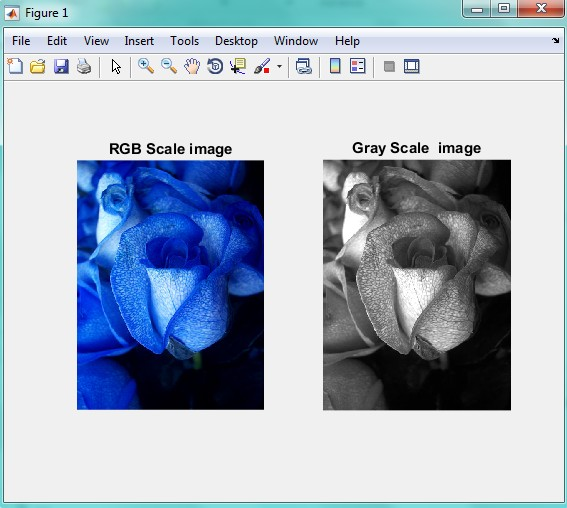

<div dir="rtl">
جواب سوال 3:
   صورت سوال: برنامه ای بنویسید که بدون استفاده از توابع متلب تصاویر benchmark را به حالت خاکستری ببرد.
   
   کدی که برای این سوال نوشتیم به صورت زیر است:
    این قسمت از برنامه، تصویر را از آدرس مورد نظرمان دریافت می کند و در سمت چپ یک صفحه 1 در 2، با عنوان RGB Scale image نمایش می دهد: 
</div>

```
input=imread('C:\Users\PC\Desktop\1.jpg');
subplot(1,2,1), imshow(input), title('RGB Scale image');
``` 

<div dir="rtl">
در ادامه، سایز تصویر ورودی را در متغیر های x  و  y  می ریزیم. دقت کنید که متغیر سوم تصاویر رنگی، بعد آن را نشان می دهند و این بعد برای ما مهم نیست. در نتیجه در متغیر ~ قرار می دهیم:
</div>

```
[x,y,~] = size(input);
```

<div dir="rtl">
در ادامه، یک حلقه تعریف می کنیم و تمام پیکسل های تصویر را یک به یک پیمایش کرده و اندازه آن پیکسل را ضرب در ضرایبی می کنیم که مقدار آن را متناظر با یک پیکسل خاکستری در بیاورد:
</div>

```
for i = 1:1:x
   for j = 1:1:y
      output(i,j) = 0.40*input(i,j,1) + 0.50*input(i,j,2) + 0.30*input(i,j,3);
   end
end
```

<div dir="rtl">
در پایان، تصویر خروجی را در سمت راست صفحه 1 در 2 با عنوان Gray Scale  image نمایش می دهیم: 
</div>

```
subplot(1,2,2), imshow(output), title('Gray Scale  image')
```

<div dir="rtl">
خروجی کد برنامه بالا به صورت زیر است:
</div>


