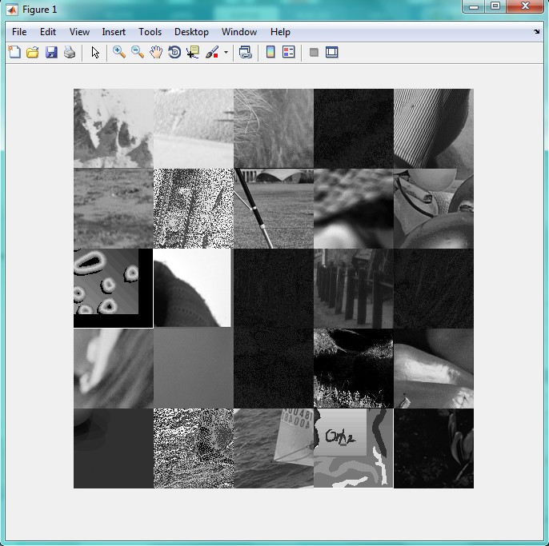

<div dir="rtl">
جواب سوال 4:
    صورت سوال: یک تصویر مربعی 500 * 500 ایجاد کنید که شامل بخش گوشه ی سمت راست و پایین تصاویر بنچ مارک ها باشد؛ از هر تصویر یک مربع 100 * 100 جدا کنید.
    کدی که برای حل این سوال نوشته شده به صورت زیر است:
    در ابتدا، مسیر فایل را با کد زیر مشخص می کنیم:
</div>

```
projectdir = 'C:\Users\PC\Documents\MATLAB\benchmark'; %moshakhas kardane masire file.
dinfo = dir(fullfile(projectdir));
dinfo([dinfo.isdir]) = []; 
nfiles = length(dinfo);
```

<div dir="rtl">
سپس یک تصویر 500 در 500 درست می کنیم:
</div>

```
picture = uint8(ones(500 , 500));
```

<div dir="rtl">
این قسمت از کد، عدد تصویر را فراخوانی می کند و در صورتی که تصویر رنگی باشد، آن را تبدیل به خاکستری کرده و در غیر این صورت، آن را به همان شکل در متغیر image قرار می دهد:
</div>

```
i = 1;
j = 1;
for amount = 1 : 25 
    filename = fullfile(projectdir, dinfo(amount).name);
    input_im = imread(filename);
    if size(input_im , 3 ) == 3 % dar soorati ke tasvir rangi bashdad, tabdil be khakestari mionim.
        image = rgb2gray(input_im);
    else % agr tasvir khakestari bood, faghat vared mikonim
        image = input_im;
    end
```
    
<div dir="rtl">
برای برش 100 در 100 از قسمت پایین سمت چپ تصاویر به این صورت عمل می کنیم:
</div>
    
```
    row = size(image , 1); 
    col = size(image , 2);
    start_i = row - 100 + 1;
    start_j = col - 100 + 1;
    
    cut = image(start_i : end , start_j : end);
    picture(i : i + 100  - 1 , j : j + 100 - 1) = cut;
    
    j = j + 100;
    if j == 501
        i = i + 100;
        j = 1;
    end
end
```

<div dir="rtl">
در انتها، با استفاده از دستور imshow تصویر خروجی را نمایش می دهیم:
</div>

```
imshow(picture);
```

<div dir="rtl">
خروجی این برنامه به صورت زیر است:
</div>


