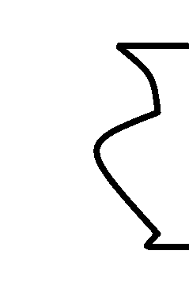
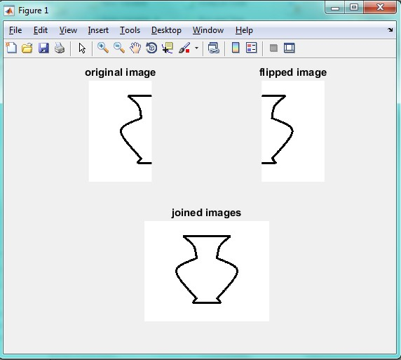

<div dir="rtl">
جواب سوال 5:
صورت سوال:یک تصویر کوزه ی ناقص رو کاغذ بکشید و تصویر آن را با کمک نرم افزار متلب کامل کنید؛ در واقع تقارن تصویر را به تصویر اصلی بچسبانید و یک کوزه ی کامل ایجاد کنید.
</div>

<div dir="rtl">
تصویری که در اختیار داریم به صورت زیر است:
</div>



<div dir="rtl">
تصویر را با تابع imread فراخوانی کرده و درون متغیر I قرار می دهیم. سپس با استفاده از تابع subplot تصویر اولمان را با عنوان original image در سمت چپ صفحه خروجی نمایش می دهیم: 
</div>

```
I = imread('C:\Users\PC\Desktop\5.png'); 
subplot(2,2,1) 
imshow(I)
title 'original image' 
```

<div dir="rtl">
حال یک تصویر آینه ای از تصویر قبلی مان ایجاد کرده و آن را درون متغیر Ir قرار می دهیم. در ادامه تصویر آینه ای را با عنوان flipped image در قسمت دوم (سمت راست-بالا) نمایش می دهیم:
</div>

```
Ir = flipdim(I,2); 
subplot(2,2,2) 
imshow(Ir)
title 'flipped image'
```

<div dir="rtl">
حال برای چسباندن این دو تصویر به هم، از تابع horzcat استفاده می کنیم و در پایان، تصویر به هم چسبیده را با عنوان joined images در صفحه خروجی نمایش می دهیم:
</div>

```
IIr = horzcat(I,Ir); 
subplot(2,2,3:4) 
imshow(IIr)
title 'joined images'
```

<div dir="rtl">
خروجی این برنامه به صورت زیر است:
</div>


