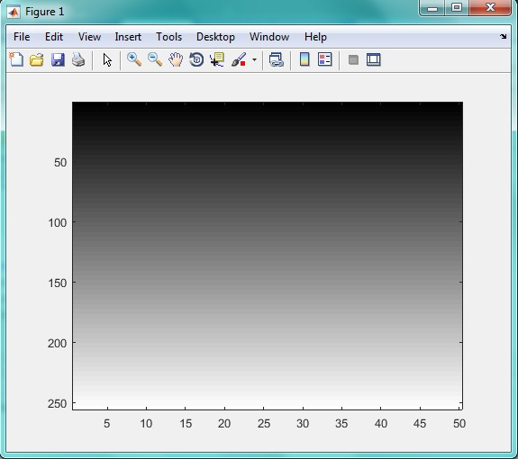

<div dir="rtl">
جواب سوال 6:
صورت سوال: یک تصویر راه راه بسازید که از سمت بالا سیاه کامل و پایین آن سفید باشد.
</div>

<div dir="rtl">
برای نمایش چنین تصویری، ابتدا در ورودی برنامه، از کاربر مقدار طول تصویر را دریافت می کنیم و درون متغیر m قرار می دهیم. البته می توانید این مقدار را به صورت ثابت به برنامه بدهید:
</div>

```
m=input('tule tasvir ra vared konid');
```

<div dir="rtl">
در ادامه، یک ماتریس صفر که تعداد سطرهایش 255 است و تعداد ستون هایش به اندازه عدد دریافت شده از ورودی است، می سازیم:
</div>

```
a=zeros(255,m);
```

<div dir="rtl">
یه حلقه درست کرده و پیکسل های تصویر را پی به یک پیمایش می کنیم. پیکس های هر سطر رنگ های یکسانی دارند و هر چه به تعداد سطر اضافه می شود، رنگ آن سرط نیز یکی افزایش پیدا می کند تا به عدد 255 که رنگ سفید است برسد. به عبارت دیگر، تصویر را را بالا به پایین و از رنگ مشکی به سفید، رنگ آمیزی می کنیم:
</div>


```
    for i=1:1:256
        for j=1:1:m
           a(i,j)=i;
                 
        end
    end
```
    
<div dir="rtl">
در پایان، تصویر را با دستورات زیر نمایش می دهیم:
</div>
    
    ```
    a
    imagesc(a)
    colormap(gray)
    
```

<div dir="rtl">
خروجی کد بالا به صورت زیر است:
</div>


