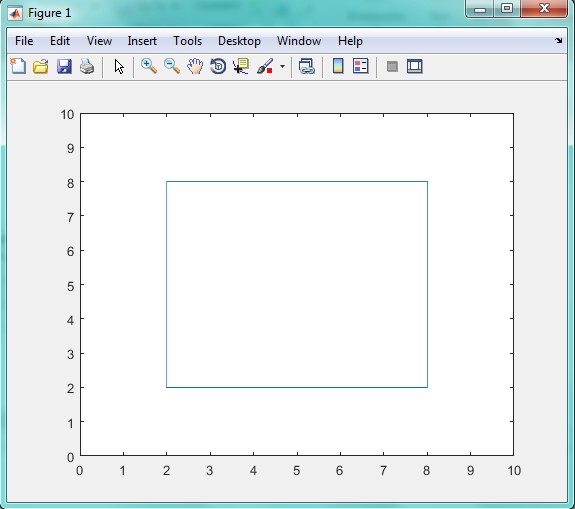
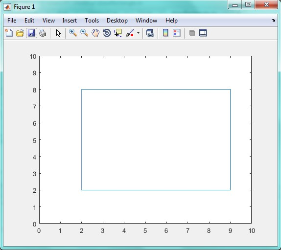
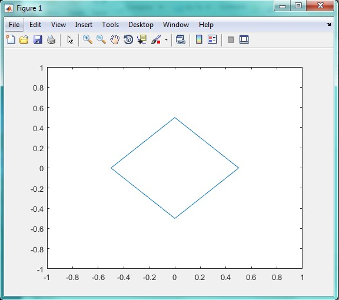
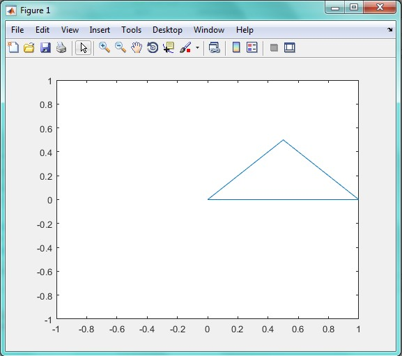

<div dir="rtl">
جواب سوال 7:
    برای رسم مربع، یک صفحه 10 در 10 مشخص کرده ایم. حال برای تعیین مختصات x و y باید به این صورت عمل کنیم که یک گوشه از مربع را انتخاب کرده و برای پیمایش محور x پاد ساعت گرد حرکت کرده و مقدار x در گوشه های تصویر را یادداشت نماییم. برای y هم به همین صورت عمل می کنیم  
</div>

```
x=[2 8 8 2 2];
y=[2 2 8 8 2];
plot(x,y);
axis([0 10 0 10]);
```



<div dir="rtl">
برای مستطیل هم به همین صورت عمل می کنیم:
</div>

```
x=[2 9 9 2 2];
y=[2 2 8 8 2];
plot(x,y);
axis([0 10 0 10]);
```



<div dir="rtl">
برای لوزی، محدوده تصویرمان را بین -1 و 1 در نظر گرفتیم:
</div>

```
x=[-0.5 0 0.5 0 -0.5];
y=[0 -0.5 0 0.5 0];
plot(x,y);
axis([-1 1 -1 1]);
```



<div dir="rtl">
برای مثلث نیز محدوده را بین -1 و 1 در نظر گرفتیم. از آنجایی که مثلث سه گوشه دارد، x و y آن 4 نقطه میگیرند.
</div>

```
x=[0 0.5 0 1];
y=[0 -0.5 0.5 1];
plot(x,y);
axis([-1 1 -1 1]);

```


