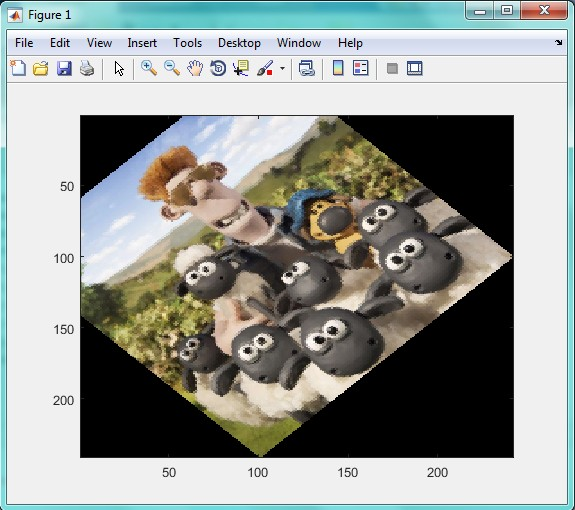
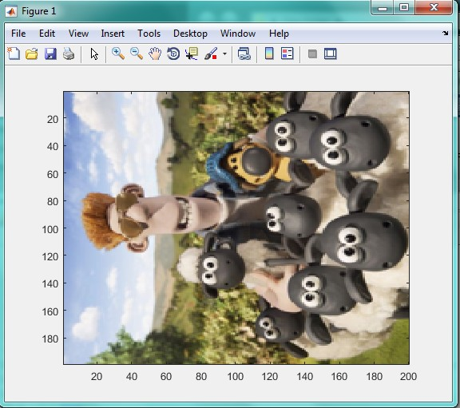
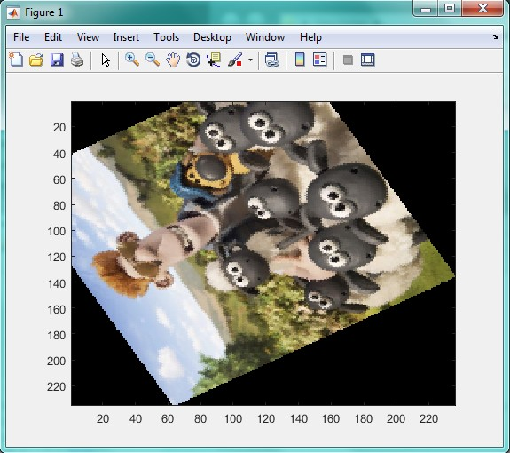
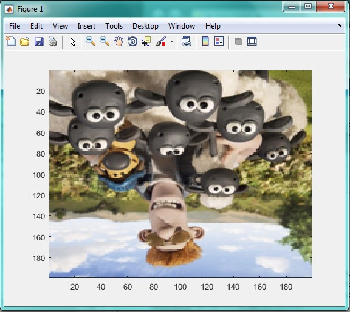

<div dir="rtl">
جواب سوال 8:بدون استفاده از توابع آماده ی متلب یک تصویر را با 45،90،120،180 درجه بچرخانید؛ در تصاویری که چرخش تصویر باعث خارج شدن از حالت مربعی می شود پیکسل های خالی را برابر رنگ مشکی قرار دهید و پیکسل های خارج شده از محدوده را نادیده بگیرید.
</div>

<div dir="rtl">
    برای حل این سوال، از چرخش پیکسل به پیکسل استفاده کردیم، در این نوع چرخش برخی از مقادیر پیکسل ها تغییر می کنند به همین دلیل کیفیت  تصویر مانند اولش نخواهد بود.
    تصویر اصلی به صورت زیر است:
</div>


<div dir="rtl">
در ابتدا، با استفاده از تابع imread تصویر مورد نظرمان را از آدرس مشخص شده می خوانیم و درون متغیر x قرار می دهیم:
</div>

```
clc;
clear;
x=imread('C:\Users\PC\Desktop\8.jpg');
```

<div dir="rtl">
حال برای راحتی کار، با استفاده از دستور imresize تصویر را به اندازه 200 در 200 در می آوریم و سپس اندازه آن را دو برابر می کنیم:
</div>

```
x=imresize(x,[200 200]);
x3=double(x);
```

<div dir="rtl">
در ادامه، دستوری تعریف می کنیم که اندازه درجه را از کاربر دریافت کند:
</div>

```
degree=input('daraje ra vared konid');
```

<div dir="rtl">
تصویر را پیکسل به پیکسل پیمایش کرده، و موقعیت آن را با استفاده از توابع مثلثاتی تعییر می دهیم. با این کار، تصویر را با توجه به درجه مشخص شده چرخش می دهیم:
</div>

```
for i=1:400
for j=1:400
x1(i,j)=round((i-100).*cosd(degree)+(j-100).*sind(degree)+100);
x2(i,j)=round(-(i-100).*sind(degree)+(j-100).*cosd(degree)+100);
if(x1(i,j)<=200)&&(x1(i,j)>0)&&(x2(i,j)<=200)&&(x2(i,j)>0)
      a(i,j,:)=x3(x1(i,j),x2(i,j),:);
  end;
  end;
  end;
```
  
<div dir="rtl">
در ادامه، تصویر را به unint8 تبدیل کرده و با استفاده از تابع imshow آن را نمایش می دهیم:
</div>

```
image(uint8(a));
imshow(a(i,j));
```

<div dir="rtl">
تصاویر پایین، به ترتیب چرخش های 45، 90، 120 و 180 هستند:
</div>








