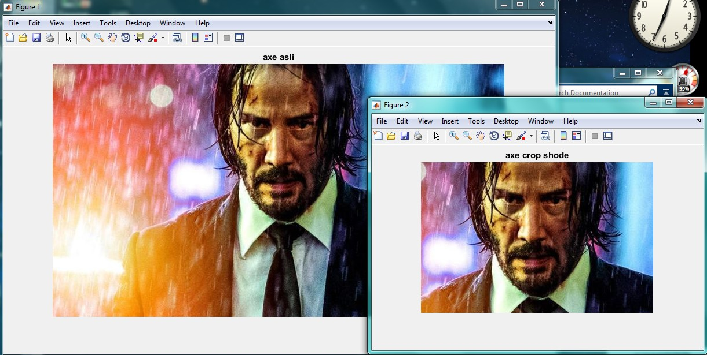

<div dir="rtl">
جواب سوال 9:
    این برنامه، نقاط شروع و پایان برش را از ورودی دریافت می کند و با توجه به آن، تصویر برش خورده خروجی را نشان می دهد:
تصویر اصلی به صورت زیر است:
</div>


```
keanu=imread('C:\Users\PC\Desktop\9.jpg');
disp('tul va raze tasvir ra baraye crop moshakhas konid:');
row_start=input('crop az che arzi shoroo shavad?');
row_end=input('crop dar che arzi tamam shavad?');
col_start=input('crop az che sotooni shoroo shavad?');
col_end=input('crop dar che sotooni  tamam shavad?');
%cropping image
cropped=keanu(row_start:row_end,col_start:col_end,:);
figure(1),imshow(keanu),title('axe asli');
figure(2),imshow(cropped),title('axe crop shode');
```

