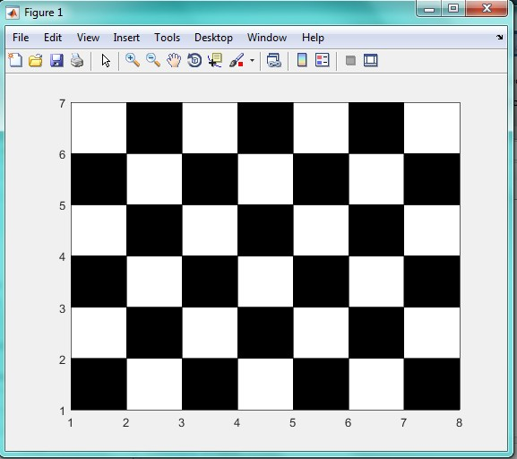

<div dir="rtl">
###جواب سوال 1 :
</div>

```
m= input('tedade satr ra vared konid=');
n= input('tedade sotun ra vared konid=');
a=1;

for i=1:1:m
    
    for j=1:1:n
       
          if a==0
            rectangle('Position',[j i 1 1], 'FaceColor',[1 1 1])
            a=1;
        else
            rectangle('Position',[j i 1 1], 'FaceColor',[0 0 0])
            a=0;
        end
        
    end
   
    * if rem(j+1,2)==1
            if a==0
            a=1;
            else
            a=0;
            end
        end
     
end
```
<div dir="rtl">
#### *: در صورتی که تعداد ستون ها فرد باشند، خروجی الگوریتم به این صورت خواهد بود که هر ستون یک رنگ دارد. برای رفع این مشکل، ازین شرط استفاده می کنیم که اگر به سطر زوج بعدی رسیدیم، مقدار  a را تغییر دهد تا رنگ خانه اول تغییر کند
</div>
 
 <div dir="rtl">
####خروجی کد به صورت زیر است : 
</div>


