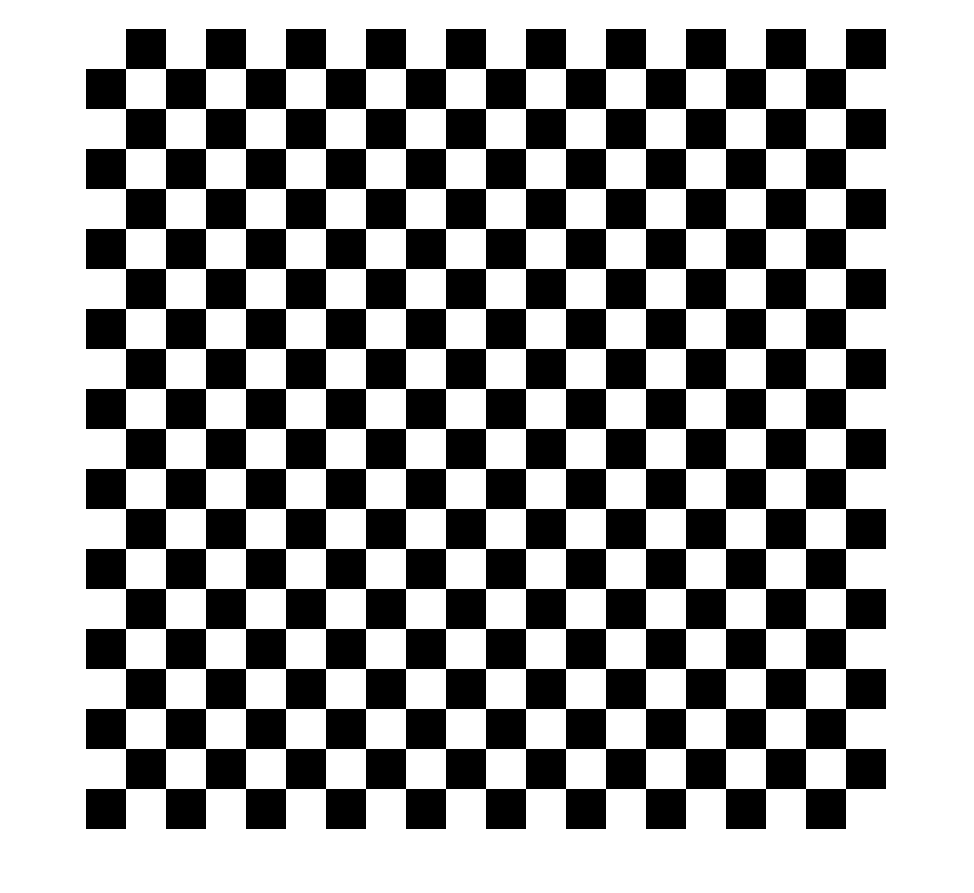

<div dir="rtl">

#### برنامه ای بنویسید که با دریافت یک طول و عرض به عنوان مقدار طول و عرض تصویر یک صفحه ی شطرنج ایجاد کنید. <br />


###### کد:
</div>

```matlab
clc;clear;close all;
%input
size_img=400;
sq=20;  

imgchess = zeros(size_img);
for i=1:sq*2:size_img
    for j=1:sq*2:size_img
        imgchess(0+i:sq+i-1,0+j:sq+j-1)=1;
        imgchess(sq+i:sq*2+i-1,sq+j:sq*2+j-1)=1;
    end
end

imshow(imgchess);
```

<div dir="rtl">

#### برسی کد:
1-دریافت ورودی اندازه تصویر و اندازه خانه شطرنجی<br />
</div>

```matlab
size_img=400;
sq=20;  
```
<div dir="rtl">
2-ایجاد کردن تصویر سیاه با ماتریس صفر<br />
</div>

```matlab
imgchess = zeros(size_img);
```
<div dir="rtl">
3-حلقه تو در تو برای ایجاد مربع های سفید  بصورت شطرنجی در ردیف های فرد و زوج<br />
</div>

```matlab
for i=1:sq*2:size_img
    for j=1:sq*2:size_img
        imgchess(0+i:sq+i-1,0+j:sq+j-1)=1;
        imgchess(sq+i:sq*2+i-1,sq+j:sq*2+j-1)=1;
    end
end
```
<div dir="rtl">
تصویر خروجی:<br />
</div>

