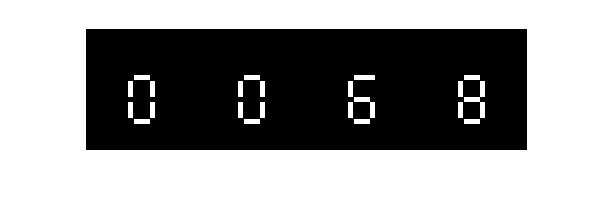

<div dir="rtl">

#### بدون استفاده از دستوران متلب یک کپچای تصویری را بکشید؛ اعداد را با تابع عدد تصادفی ایجاد کنید و سپس با توجه به اعداد بدست آمده برای هر یک در تصویر پیکسل های مورد نظر را رسم کنید؛ تصویر باینری باشد و اعداد رنگ سفید و پیش زمینه رنگ مشکی داشته باشد. <br />


###### کد:
</div>

```matlab
clc;clear;close all;
img=im2bw(imread('0-9.jpg'));
%imshow(img);
imgcaptcha=zeros(0,0,'logical');
for i=0:3
    B=randi([0,9]);
    C=B*110+1;
    D=i*110+1;
    imgcaptcha(1:size(img,1),D:D+110) = img(1:size(img,1), C:C+110, :);
end    
figure;
imshow(imgcaptcha);
```

<div dir="rtl">

#### برسی کد:
1-پیدا کردن اسامی کلیه تصویر موجود در پوشه بنچ مارک با پسوند های مورد نظر <br />
دستور dir یک آرایه از فیلد های داده که حاوی مشخصات فایلها بر می گرداند.
</div>

```matlab
imgpath = "../../../benchmark/";
pngfiles = dir(imgpath+'*.png');
tiffiles = dir(imgpath+'*.tif');
bmpfiles = dir(imgpath+'*.bmp');
```
<div dir="rtl">
2-سه آرایه با فیلدهای یکسان را با هم در یک آریه ترکیب می کند<br />
</div>

```matlab
imagefiles = [pngfiles;tiffiles;bmpfiles];
```

<div dir="rtl">
3-ایجاد تصویر رنگی RGB به ابعاد 500*500*3 با ایجاد ماتریس با درایه یک <br />
</div>

```matlab
img = ones(500, 500, 3,'uint8');
```
<div dir="rtl">
4-به ازای افزایش متغییر حلقه یکی از تصاویر با توجه به ادرس آنها در آرایه بار می شود و در خط چهارم قسمت گوشه پایین سمت راست تصویر جاری جدا می شود در خط پنجم چک می شود که در صورت رنگی نبودن تصویر سه کانال رنگ با مقادیر یکسان تصویر خاکستری پر  می شود در خط هشتم موقعت ردیف و ستون قرار گیری این برش در تصویر نهایی مشخص می شود. و در خط آخر قسمت برش خورده در محل خود کپی می شود.<br />
</div>

```matlab
for ii=1:25
   currentimg = imread(imgpath+imagefiles(ii).name);
   [sx,sy,sz]=size(currentimg);
   imgcut=currentimg(sx-100:sx,sy-100:sy,:);
   if sz==1
       imgcut=cat(3,imgcut,imgcut,imgcut);
   end
   mo=mod(ii-1,5)*100;di=fix((ii-1)/5)*100;
   img(di+1:di+101,mo+1:mo+101,:)=imgcut(1:101,1:101,:);
end
```
<div dir="rtl">
تصویر خروجی:<br />
</div>

