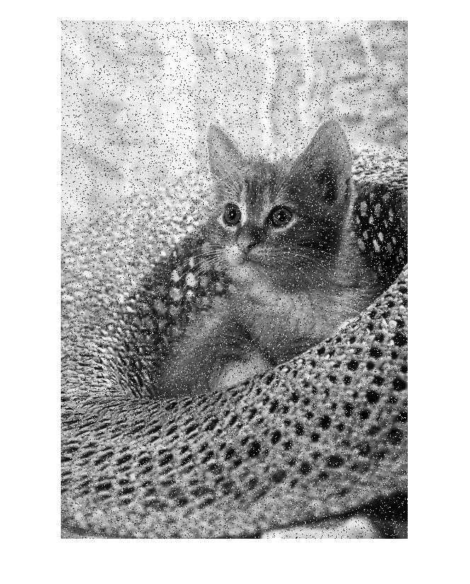

<div dir="rtl">

#### بدون استفاده از دستورهای آماده ی متلب نویز فلفل نمکی را روی چند تصویر ایجاد کنید. <br />


###### کد:
</div>

```matlab
lc;clear;close all;
img=rgb2gray(imread("../../../benchmark/cat.png"));
 
for i=1:30000
    X=randi([1,size(img,1)]);
    Y=randi([1,size(img,2)]);
    img(X,Y)=randi([0,1])*255;
end
imshow(img);
```

<div dir="rtl">

#### برسی کد:

1.
- تصویر گربه در شاخه بنچ مارک خواندخ شدخ و توسط دستور rgb2gray بصورت خاکستری در متغییر img قرار میگیرد.
  
</div>

```matlab
img=rgb2gray(imread("../../../benchmark/cat.png"));
```
<div dir="rtl">

2.
- در حلقه for زیر به تعداد 30000 عدد تصادفی نقاط تصویر انتخاب شده و به رنگ سفید یا سیاه که ان هم تصادفی است در می آیند.
</div>

```matlab
for i=1:30000
    X=randi([1,size(img,1)]);
    Y=randi([1,size(img,2)]);
    img(X,Y)=randi([0,1])*255;
end
```

<div dir="rtl">

3.
- در نهایت تصویر حاصله که در ماتریس img قرار دارد توسط دستور imshow نمایش داده می شود.
</div>

```matlab
imshow(img);
```

<div dir="rtl">
تصویر خروجی:<br />
</div>

