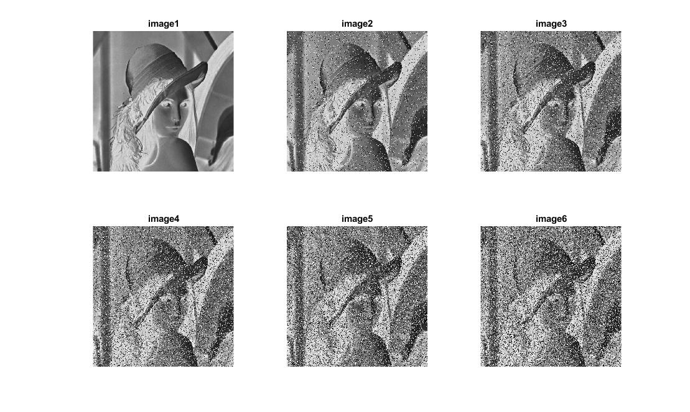
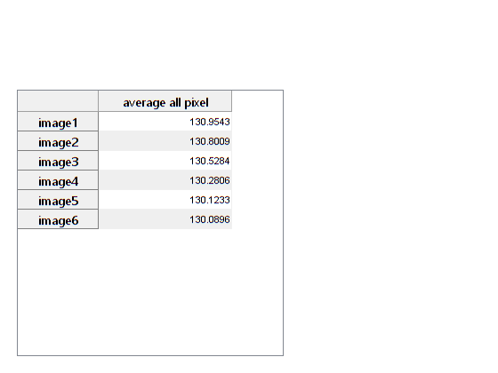

<div dir="rtl">

#### روی یک تصویر نگاتیو نویز فلفل نمکی را با اعداد مختلف امتحان کنید و میانگین تمام پیکسل های آن را در یک جدول خروجی دهید.


###### کد:
</div>

```matlab
clc;clear;close all;
dd=[0,20000,20000,20000,20000,20000];

img = imread('../../../benchmark/lena.png');
img = rgb2gray(img);
[r,c,d] = size(img);

img(:,:,:)=255-img(:,:,:);

num=length(dd);
dataAvg=zeros(num,1);
rnames = strings(1,num);
for n = 1:num
    sum=0;
    for i=1:dd(n)
        X=randi([1,r]);
        Y=randi([1,c]);
        img(X,Y,:)=randi([0,1])*255;
    end
    
    %method 1
    avg=mean(img(:));
    
    %method 2
    for i=1:r
        for j=1:c
            sum=sum+double(img(i,j));
        end
    end
    avgm=sum/(r*c);
    dataAvg(n,1) = avgm;
    rnames(1,n)=strcat('image',int2str(n));
    subplot(2,fix((num+1)/2),n),imshow(img),title(rnames(n));
end
figure;
cnames = {'average all pixel'};

% Create the uitable
t = uitable('Data',dataAvg,...
            'ColumnName',cnames,... 
            'RowName',rnames,...
            'ColumnWidth',{150});
```

<div dir="rtl">

#### برسی کد:

1.
- آرایه ای از مقادیر مختلف نویز فلفل نمکی تریف شده اسن هر عدد نشان دهنده تعداد نقاط نویز است.

</div>

```matlab
dd=[0,20000,20000,20000,20000,20000];
```
<div dir="rtl">

2.
- خواندن تصویر از فولدر بنچ مارک و قرار دادن در ماتریس img.
- در خط دو تبدیل تصویر رنگی به خاکستری با دستور rgb2gray.
- قرار دادن ابعاد تصویر در متغیر مربوطه.
</div>

```matlab
img = imread('../../../benchmark/lena.png');
img = rgb2gray(img);
[r,c,d] = size(img);
```

<div dir="rtl">

3.
- تبدیل تصویر به نگاتیو.
</div>

```matlab
img(:,:,:)=255-img(:,:,:);
```
<div dir="rtl">

4.
- طول آرایه که مقادیر مختلف نویز را نگه می دارد در متغییر num قرار میدهد.
- یک آرایه به طول num ایجاد و آن را با صفر پر میکند.
- در خط سوم یک رشته کاراکتری به طول num ایجاد می کند.
</div>

```matlab
num=length(dd);
dataAvg=zeros(num,1);
rnames = strings(1,num);
```


<div dir="rtl">

5.
- حلقه for بیرونی به تعداد نویزهای مختافی که قرار است ایجاد شود تکرار می شود.
- اولین حلقه داخلی با توجه به مقدار نویز ذخیره شده در آرایه dd نویز را روی تصویر با نقاط تصادفی اعمال می کند.
- سپس ما با دو روش میانگین مقادیر تمام پیکسلهای تصویر را پیدا کرده ایم که کد آن واضح است ونیاز به توضیح ندارد.
- سه خط آخر به ترتیب مقدارهای میانگین را در آرایه قرار میدهد سپس شماره ردیف را ایجاد می کند و در آخر تصویر مربوطه را نمایش می دهد.
</div>

```matlab
for n = 1:num
    sum=0;
    for i=1:dd(n)
        X=randi([1,r]);
        Y=randi([1,c]);
        img(X,Y,:)=randi([0,1])*255;
    end
    
    %method 1
    avg=mean(img(:));
    
    %method 2
    for i=1:r
        for j=1:c
            sum=sum+double(img(i,j));
        end
    end
    avgm=sum/(r*c);
    dataAvg(n,1) = avgm;
    rnames(1,n)=strcat('image',int2str(n));
    subplot(2,fix((num+1)/2),n),imshow(img),title(rnames(n));
end
```
<div dir="rtl">
تصویر خروجی:<br />
</div>



<div dir="rtl">

6.
- برای چاپ جدول در خط دوم نام جدول مشخص شده
- دستورر uitable با توجه به پارامترهای ورودی جدول را ایجاد می کند . پارامتر اول داده ها و پرامتر دوم نام جدولو پارامتر سوم نام ستون و پارامتر چهارم طول ستون به پیکسل را میگیرد.
</div>

```matlab
figure;
cnames = {'average all pixel'};

% Create the uitable
t = uitable('Data',dataAvg,...
            'ColumnName',cnames,... 
            'RowName',rnames,...
            'ColumnWidth',{150});

```

<div dir="rtl">
تصویر خروجی:<br />
</div>

