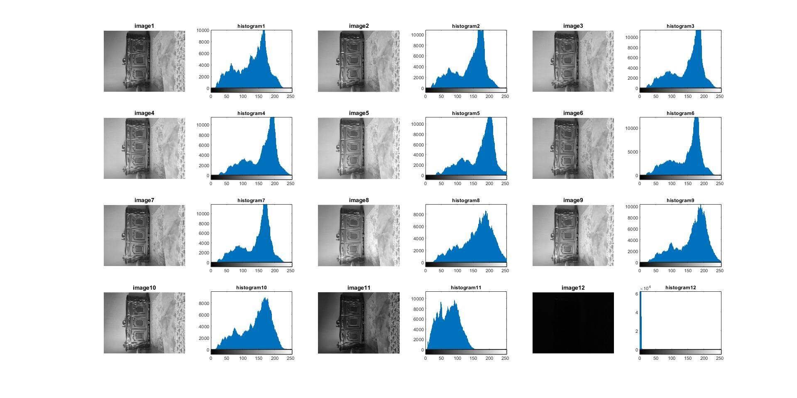

<div dir="rtl">

#### 14. یک دیتاست تصویری از 12 ساعت مختلف یک شبانه روز ایجاد کنید و این تصاویر را به grayscale تبدیل کنید و هیستوگرام هر کدام را با یکدیگر مقایسه کنید.


###### کد:
</div>

```matlab
clc;clear;close all;

for n=1:12
    img=imread(strcat('resourcemain\image',int2str(n),'.jpg'));
    img=rgb2gray(img);
    subplot(4,6,n*2-1),imshow(img),title(strcat('image',int2str(n)));
    subplot(4,6,n*2),imhist(img),title(strcat('histogram',int2str(n)));
end
```

<div dir="rtl">

#### برسی کد:

1.
- حلقه for به تعداد تصاویر تکرار می شود .

</div>

```matlab
for n=1:12
```
<div dir="rtl">

2.
- در هر تکرار حلقه یک تصویر خوانده شده و در ماتریس img قرار می گیرد.
- تصویر رنگی به تصویر خاکستری تبدیل می شود.
</div>

```matlab
img=imread(strcat('resourcemain\image',int2str(n),'.jpg'));
img=rgb2gray(img);
```

<div dir="rtl">

3.
- در خط اول هر تصویر در subplot جهت نمایش قرار میگیرد.
- در خط دوم هیستو گرام هر تصویر در کنار آن در subplot جهت نمایش قرار میگیرد.
</div>

```matlab
subplot(4,6,n*2-1),imshow(img),title(strcat('image',int2str(n)));
subplot(4,6,n*2),imhist(img),title(strcat('histogram',int2str(n)));
```

<div dir="rtl">
تصویر خروجی:<br />
</div>



