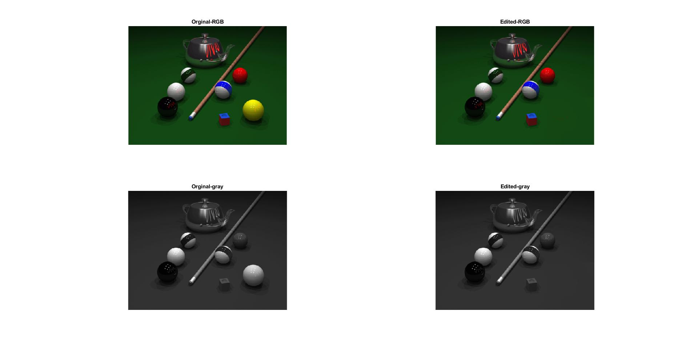

<div dir="rtl">

#### ابتدا تصویر pool.png را به grayscale تبدیل کنید و سپس  توپ زرد را از تصویر حذف کنید. <br />


###### کد:
</div>

```matlab
clc;clear;close all;
img=(imread("../../../benchmark/pool.png"));
imggray=rgb2gray(img);
subplot(2,2,1),imshow(img),title('Orginal-RGB');
subplot(2,2,3),imshow(imggray),title('Orginal-gray');
[sr,sc] = size(imggray);
for x=1:sr
   for y=1:sc
       if ((imggray(x,y) > 50) || (imggray(x,y) < 48)) && (x >230) && (y >355)
            imggray(x,y) = 49;
            img(x,y,1) = 20;img(x,y,2) = 70;img(x,y,3) =20;
       end
   end
end
subplot(2,2,2),imshow(img),title('Edited-RGB');
subplot(2,2,4),imshow(imggray),title('Edited-gray');
```

<div dir="rtl">

#### برسی کد:

1.
- خط اول تصویر pool.png  را از پوشه بنچ مارک خوانده و آن را در ماتریس img ذخیره می کند.
- تصویر رنگی را به خاکستری تبدیل و در ماتریس imggray ذخیره می کنید. با
- در دو خط 3و4 تصاویر را در subplot جهت نمایش قرار می دهید.
- ابعاد تصویر را در دو متغییر sr و sc قرار میدهد.
</div>

```matlab
img=(imread("../../../benchmark/pool.png"));
imggray=rgb2gray(img);
subplot(2,2,1),imshow(img),title('Orginal-RGB');
subplot(2,2,3),imshow(imggray),title('Orginal-gray');
[sr,sc] = size(imggray);
```
<div dir="rtl">

2.
- جلقه تو در تو کل پیکسلهای تصویر را پیمایش می کند.
- مقادیر تمام پیکسل هایی که در شرط حلقه صدق میکنند به 49 کهرنگ همساسه آن است تغییر می کنید
- از روی همین شرط تصویر رنگی هم به حاشیه تغییر کرده استفاده
   حالا هم تصویر خاکستری و هم در تصویر رنگی توپ زرد حذف شده است.
</div>

```matlab
for x=1:sr
   for y=1:sc
       if ((imggray(x,y) > 50) || (imggray(x,y) < 48)) && (x >230) && (y >355)
            imggray(x,y) = 49;
            img(x,y,1) = 20;img(x,y,2) = 70;img(x,y,3) =20;
       end
   end
end
```

<div dir="rtl">

3.
- در نهایت هر دو تصویر خاکستری و رنگی نتیجه در subplot جهت نمایش قرار داده شده است.
</div>

```matlab
subplot(2,2,2),imshow(img),title('Edited-RGB');
subplot(2,2,4),imshow(imggray),title('Edited-gray');
```
<div dir="rtl">
تصویر خروجی:<br />
</div>

