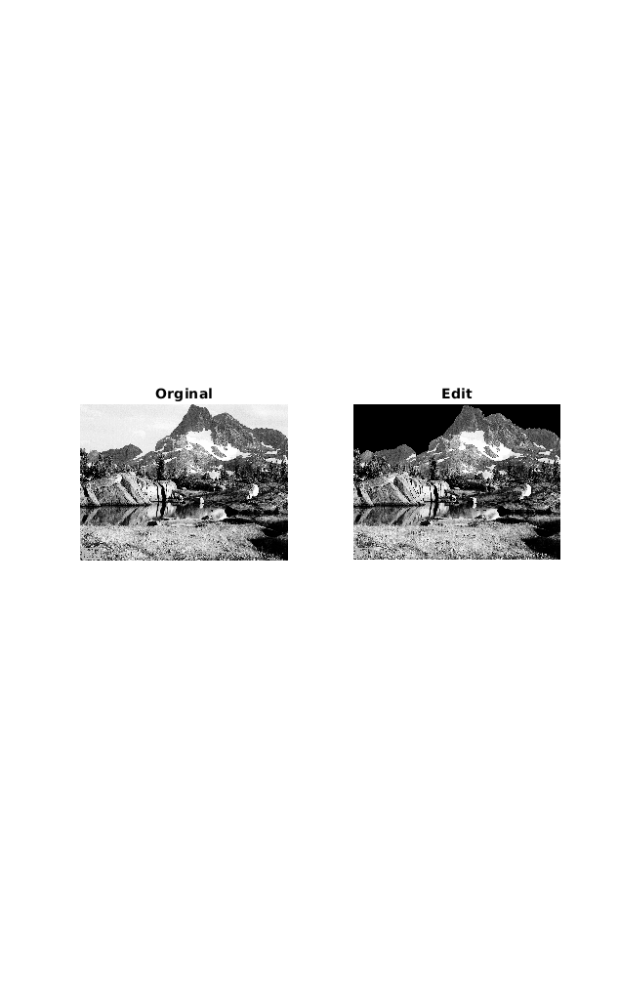

<div dir="rtl">

####  آسمان تصویر mountain.png را سیاه رنگ کنید. <br />


###### کد:
</div>

```matlab
clc;clear;close all;
img=imread("../../../benchmark/mountain.png");
subplot(1,2,1),imshow(img),title('Orginal');
[m, n] = size(img);
for x=1:m
   for y=1:n
       if  img(x,y) >200
           img(x,y) = 0;
       end 
       if img(x+1,y)<180
           break;
       end
   end
end
subplot(1,2,2),imshow(img),title('Edit');
```
---
<div dir="rtl">

#### برسی کد:
1-
- خواندن تصویر mountain.png از شاخه بنچ مارک در ماتریس img
- نمایش تصویر با دستور subplot 
- بدست آوردن ابعاد ماتریس و قرار دان آنها در متغیر مربوطه
</div>

```matlab
img=imread("../../../benchmark/mountain.png");
subplot(1,2,1),imshow(img),title('Orginal');
[m, n] = size(img);
```
---
<div dir="rtl">

2-
- حلقه for تودرتو که کل ماتریس تصویر را پیمایش می کند. 
- شرط های if درون حلقه داخلی پیکسل هایی را که در شرط صدق می کنند برابر صفر قرار میدهد.
- نکته اصلی در این پیمایش با توجه به تصویر این است که پیمایش بصورت عمودی صورت می گیرد.
</div>

```matlab
for x=1:m
   for y=1:n
       if  img(x,y) >200
           img(x,y) = 0;
       end 
       if img(x+1,y)<180
           break;
       end
   end
end
```
---
<div dir="rtl">

3-
- نمایش تصویر خروجی با دستور subplot
</div>

```matlab
subplot(1,2,2),imshow(img),title('Edit');
```
<div dir="rtl">
تصویر خروجی:<br />
</div>


