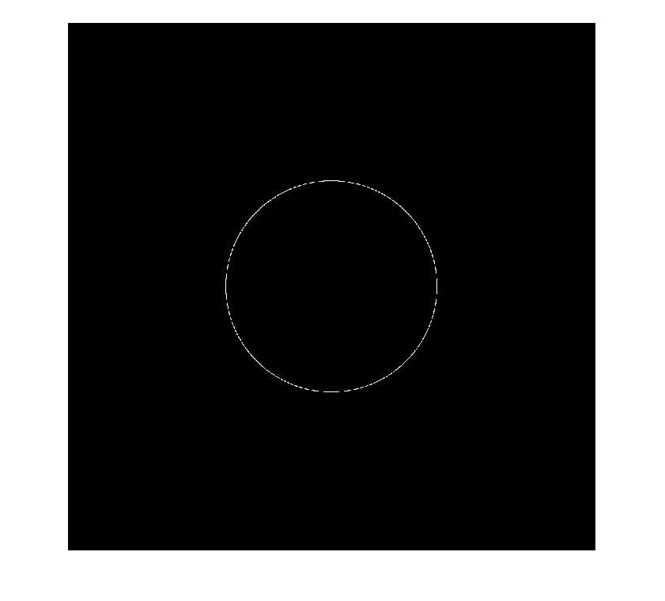

<div dir="rtl">

#### برنامه ای بنویسید که یک عدد را به عنوان شعاع دایره و یه عدد را به عنوان مکان رسم دایره از بگیرد و در یک تصویر 1000*1000 پیکسل مشکی رنگ آن دایره را با رنگ سفید نمایش دهد. <br />


###### کد:
</div>

```matlab
clc;clear;close all;

%input
r=300;
xx=500;yy=500;
img=zeros(1000);

%draw circle
for th =0:1/r:2*pi
    x = round(r * cos(th)) + xx;
    y = round(r * sin(th)) + yy;
    img(x, y)=1;
end
imshow(img);
```

<div dir="rtl">

#### برسی کد:
1-دریافت ورودی شعاع دایره و مختصات مرکز دایره<br />
</div>

```matlab
r=300;
xx=500;yy=500;  
```
<div dir="rtl">
2-ایجاد کردن تصویر سیاه به ابعاد 1000 در 1000 پیکسل با ماتریس صفر<br />
</div>

```matlab
img=zeros(1000);
```
<div dir="rtl">
3-حلقه برای ایجاد دایره سفید  گام حلقه 1/r است تا دقیقا یک پیکسل روی محیط دایره سفید گردد.<br />
</div>

```matlab
for th =0:1/r:2*pi
    x = round(r * cos(th)) + xx;
    y = round(r * sin(th)) + yy;
    img(x, y)=1;
end
```
<div dir="rtl">
تصویر خروجی:<br />
</div>

